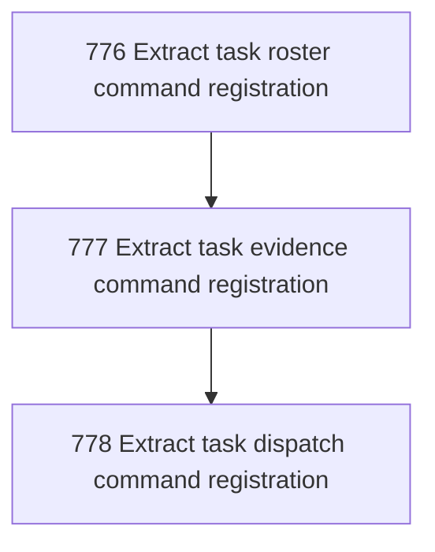

# Task Control Registration Normalization

## Goal

<!-- Goal placeholder -->

## DAG

## Active Tasks

| # | Task | Name | Purpose |
|---|------|------|---------|
| 1 | 776 | Extract task roster command registration | Move task roster CLI registration out of main.ts into a dedicated registration module while preserving command behavior and shared output admission. |
| 2 | 777 | Extract task evidence command registration | Move task evidence CLI registration out of main.ts into a dedicated module and make the output admission path uniform. |
| 3 | 778 | Extract task dispatch command registration | Move task dispatch CLI registration out of main.ts into a dedicated module with resource-scoped shared command handling. |

## CCC Posture

| Coordinate | Evidenced State | Projected State If Chapter Verifies | Pressure Path | Evidence Required |
|------------|-----------------|-------------------------------------|---------------|-------------------|
| semantic_resolution | 0 | 0 | TBD | TBD |
| invariant_preservation | 0 | 0 | TBD | TBD |
| constructive_executability | 0 | 0 | TBD | TBD |
| grounded_universalization | 0 | 0 | TBD | TBD |
| authority_reviewability | 0 | 0 | TBD | TBD |
| teleological_pressure | 0 | 0 | TBD | TBD |

## Deferred Work

| Deferred Capability | Rationale |
|---------------------|-----------|
| **TBD** | TBD |

## Closure Criteria

- [ ] All tasks in this chapter are closed or confirmed.
- [ ] Semantic drift check passes.
- [ ] Gap table produced.
- [ ] CCC posture recorded.
