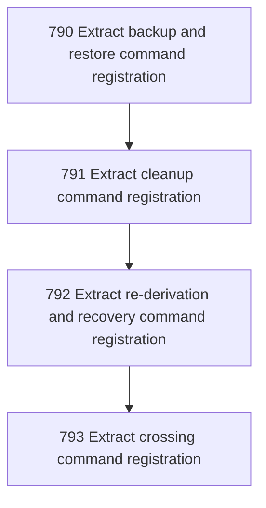

# Command Surface Normalization

## Goal

<!-- Goal placeholder -->

## DAG

## Active Tasks

| # | Task | Name | Purpose |
|---|------|------|---------|
| 1 | 790 | Extract backup and restore command registration | Move backup, restore, backup-verify, and backup-ls command construction out of main.ts into a dedicated registrar without changing command semantics or output. |
| 2 | 791 | Extract cleanup command registration | Move cleanup command construction out of main.ts into a dedicated registrar while preserving bounded operator behavior. |
| 3 | 792 | Extract re-derivation and recovery command registration | Move derive-work, preview-work, confirm-replay, and recover command construction out of main.ts into a dedicated registrar while preserving the recovery/derivation authority distinction. |
| 4 | 793 | Extract crossing command registration | Move crossing command registration out of main.ts into a dedicated registrar and preserve crossing inspection as a bounded read-only surface. |

## CCC Posture

| Coordinate | Evidenced State | Projected State If Chapter Verifies | Pressure Path | Evidence Required |
|------------|-----------------|-------------------------------------|---------------|-------------------|
| semantic_resolution | 0 | 0 | TBD | TBD |
| invariant_preservation | 0 | 0 | TBD | TBD |
| constructive_executability | 0 | 0 | TBD | TBD |
| grounded_universalization | 0 | 0 | TBD | TBD |
| authority_reviewability | 0 | 0 | TBD | TBD |
| teleological_pressure | 0 | 0 | TBD | TBD |

## Deferred Work

| Deferred Capability | Rationale |
|---------------------|-----------|
| **TBD** | TBD |

## Closure Criteria

- [ ] All tasks in this chapter are closed or confirmed.
- [ ] Semantic drift check passes.
- [ ] Gap table produced.
- [ ] CCC posture recorded.
