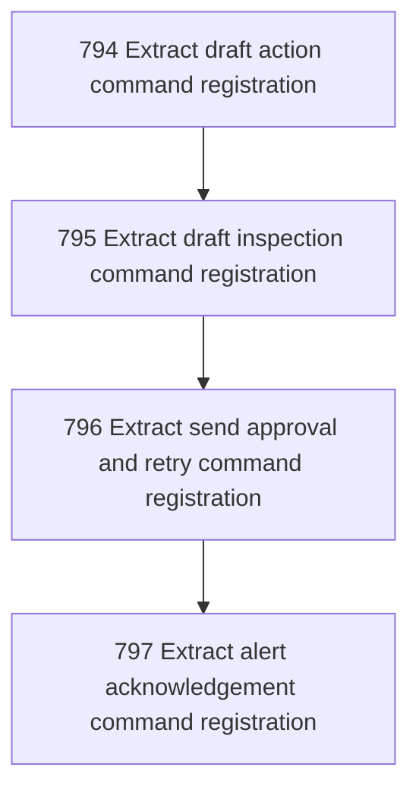

# Outbound Action Registration

## Goal

<!-- Goal placeholder -->

## DAG

## Active Tasks

| # | Task | Name | Purpose |
|---|------|------|---------|
| 1 | 794 | Extract draft action command registration | Move reject-draft, mark-reviewed, and handled-externally command construction out of main.ts into a dedicated outbound action registrar. |
| 2 | 795 | Extract draft inspection command registration | Move drafts and show-draft command construction out of main.ts into the outbound action registrar while preserving bounded inspection behavior. |
| 3 | 796 | Extract send approval and retry command registration | Move approve-draft-for-send and retry-auth-failed command construction out of main.ts into the outbound action registrar. |
| 4 | 797 | Extract alert acknowledgement command registration | Move acknowledge-alert command construction out of main.ts into the outbound action registrar and verify the family as one command surface. |

## CCC Posture

| Coordinate | Evidenced State | Projected State If Chapter Verifies | Pressure Path | Evidence Required |
|------------|-----------------|-------------------------------------|---------------|-------------------|
| semantic_resolution | 0 | 0 | TBD | TBD |
| invariant_preservation | 0 | 0 | TBD | TBD |
| constructive_executability | 0 | 0 | TBD | TBD |
| grounded_universalization | 0 | 0 | TBD | TBD |
| authority_reviewability | 0 | 0 | TBD | TBD |
| teleological_pressure | 0 | 0 | TBD | TBD |

## Deferred Work

| Deferred Capability | Rationale |
|---------------------|-----------|
| **TBD** | TBD |

## Closure Criteria

- [ ] All tasks in this chapter are closed or confirmed.
- [ ] Semantic drift check passes.
- [ ] Gap table produced.
- [ ] CCC posture recorded.
