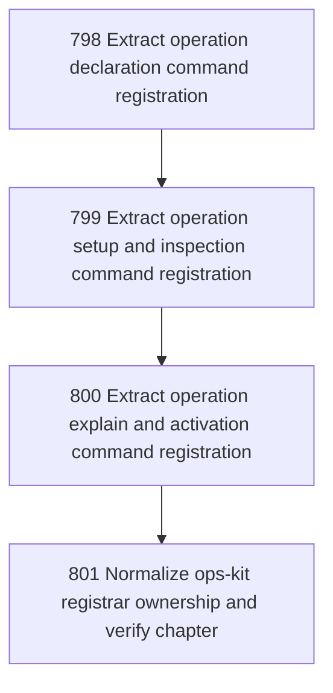

# Ops Kit Registration

## Goal

<!-- Goal placeholder -->

## DAG

## Active Tasks

| # | Task | Name | Purpose |
|---|------|------|---------|
| 1 | 798 | Extract operation declaration command registration | Move init-repo, want-mailbox, want-workflow, and want-posture command construction out of main.ts into an ops-kit registrar. |
| 2 | 799 | Extract operation setup and inspection command registration | Move setup, preflight, and inspect command construction out of main.ts into the ops-kit registrar. |
| 3 | 800 | Extract operation explain and activation command registration | Move explain and activate command construction out of main.ts into the ops-kit registrar while preserving activation failure handling. |
| 4 | 801 | Normalize ops-kit registrar ownership and verify chapter | Remove direct ops-kit command imports and formatting from main.ts, then verify and close the chapter. |

## CCC Posture

| Coordinate | Evidenced State | Projected State If Chapter Verifies | Pressure Path | Evidence Required |
|------------|-----------------|-------------------------------------|---------------|-------------------|
| semantic_resolution | 0 | 0 | TBD | TBD |
| invariant_preservation | 0 | 0 | TBD | TBD |
| constructive_executability | 0 | 0 | TBD | TBD |
| grounded_universalization | 0 | 0 | TBD | TBD |
| authority_reviewability | 0 | 0 | TBD | TBD |
| teleological_pressure | 0 | 0 | TBD | TBD |

## Deferred Work

| Deferred Capability | Rationale |
|---------------------|-----------|
| **TBD** | TBD |

## Closure Criteria

- [ ] All tasks in this chapter are closed or confirmed.
- [ ] Semantic drift check passes.
- [ ] Gap table produced.
- [ ] CCC posture recorded.
