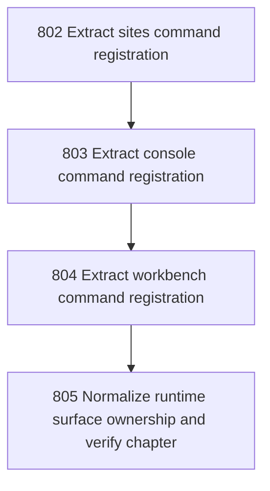

# Runtime Surface Registration

## Goal

<!-- Goal placeholder -->

## DAG

## Active Tasks

| # | Task | Name | Purpose |
|---|------|------|---------|
| 1 | 802 | Extract sites command registration | Move the sites command group out of main.ts into a dedicated registrar while preserving Site registry behavior. |
| 2 | 803 | Extract console command registration | Move the console command group out of main.ts into a dedicated registrar while preserving cross-Site control behavior. |
| 3 | 804 | Extract workbench command registration | Move the workbench command group out of main.ts into a dedicated registrar while preserving bounded diagnostics and server behavior. |
| 4 | 805 | Normalize runtime surface ownership and verify chapter | Remove direct runtime-surface imports and inline command construction from main.ts, then verify and close the chapter. |

## CCC Posture

| Coordinate | Evidenced State | Projected State If Chapter Verifies | Pressure Path | Evidence Required |
|------------|-----------------|-------------------------------------|---------------|-------------------|
| semantic_resolution | 0 | 0 | TBD | TBD |
| invariant_preservation | 0 | 0 | TBD | TBD |
| constructive_executability | 0 | 0 | TBD | TBD |
| grounded_universalization | 0 | 0 | TBD | TBD |
| authority_reviewability | 0 | 0 | TBD | TBD |
| teleological_pressure | 0 | 0 | TBD | TBD |

## Deferred Work

| Deferred Capability | Rationale |
|---------------------|-----------|
| **TBD** | TBD |

## Closure Criteria

- [ ] All tasks in this chapter are closed or confirmed.
- [ ] Semantic drift check passes.
- [ ] Gap table produced.
- [ ] CCC posture recorded.
