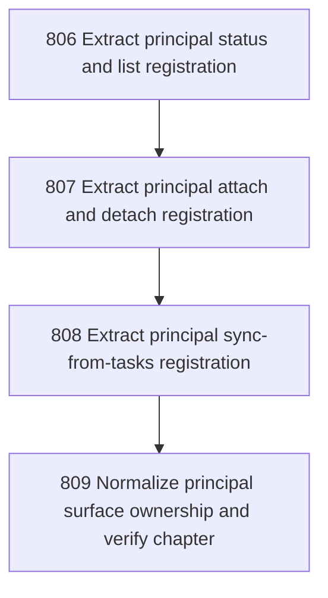

# Principal Registration

## Goal

<!-- Goal placeholder -->

## DAG

## Active Tasks

| # | Task | Name | Purpose |
|---|------|------|---------|
| 1 | 806 | Extract principal status and list registration | Move principal status and list command construction out of main.ts into a dedicated registrar. |
| 2 | 807 | Extract principal attach and detach registration | Move principal attach and detach command construction out of main.ts into the principal registrar. |
| 3 | 808 | Extract principal sync-from-tasks registration | Move principal sync-from-tasks command construction out of main.ts into the principal registrar. |
| 4 | 809 | Normalize principal surface ownership and verify chapter | Remove direct principal command imports and inline construction from main.ts, then verify and close the chapter. |

## CCC Posture

| Coordinate | Evidenced State | Projected State If Chapter Verifies | Pressure Path | Evidence Required |
|------------|-----------------|-------------------------------------|---------------|-------------------|
| semantic_resolution | 0 | 0 | TBD | TBD |
| invariant_preservation | 0 | 0 | TBD | TBD |
| constructive_executability | 0 | 0 | TBD | TBD |
| grounded_universalization | 0 | 0 | TBD | TBD |
| authority_reviewability | 0 | 0 | TBD | TBD |
| teleological_pressure | 0 | 0 | TBD | TBD |

## Deferred Work

| Deferred Capability | Rationale |
|---------------------|-----------|
| **TBD** | TBD |

## Closure Criteria

- [ ] All tasks in this chapter are closed or confirmed.
- [ ] Semantic drift check passes.
- [ ] Gap table produced.
- [ ] CCC posture recorded.
