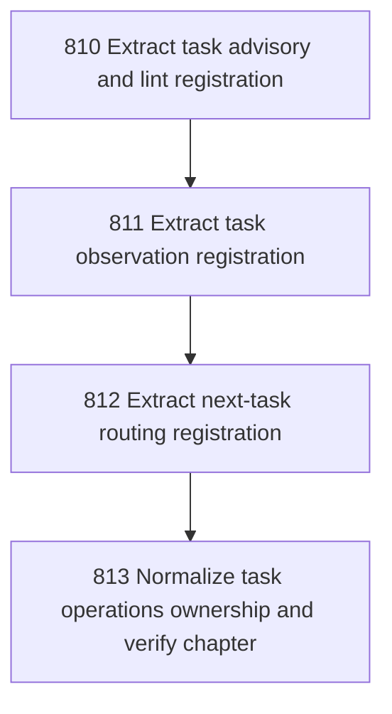

# Task Operations Registration

## Goal

<!-- Goal placeholder -->

## DAG

## Active Tasks

| # | Task | Name | Purpose |
|---|------|------|---------|
| 1 | 810 | Extract task advisory and lint registration | Move task recommend, derive-from-finding, and lint command construction out of main.ts into a dedicated task operations registrar. |
| 2 | 811 | Extract task observation registration | Move task list, search, read, and graph command construction out of main.ts into the task operations registrar. |
| 3 | 812 | Extract next-task routing registration | Move task peek-next, pull-next, and work-next command construction out of main.ts into the task operations registrar. |
| 4 | 813 | Normalize task operations ownership and verify chapter | Remove direct task operation imports and inline construction from main.ts, then verify and close the chapter. |

## CCC Posture

| Coordinate | Evidenced State | Projected State If Chapter Verifies | Pressure Path | Evidence Required |
|------------|-----------------|-------------------------------------|---------------|-------------------|
| semantic_resolution | 0 | 0 | TBD | TBD |
| invariant_preservation | 0 | 0 | TBD | TBD |
| constructive_executability | 0 | 0 | TBD | TBD |
| grounded_universalization | 0 | 0 | TBD | TBD |
| authority_reviewability | 0 | 0 | TBD | TBD |
| teleological_pressure | 0 | 0 | TBD | TBD |

## Deferred Work

| Deferred Capability | Rationale |
|---------------------|-----------|
| **TBD** | TBD |

## Closure Criteria

- [ ] All tasks in this chapter are closed or confirmed.
- [ ] Semantic drift check passes.
- [ ] Gap table produced.
- [ ] CCC posture recorded.
