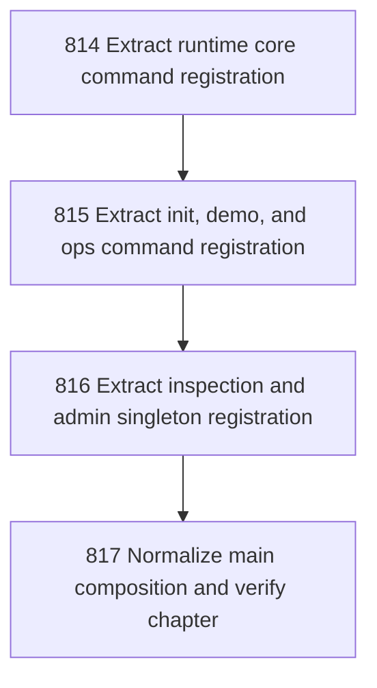

# Core Command Registration

## Goal

<!-- Goal placeholder -->

## DAG

## Active Tasks

| # | Task | Name | Purpose |
|---|------|------|---------|
| 1 | 814 | Extract runtime core command registration | Move sync, cycle, integrity, rebuild-views, and rebuild-projections command construction out of main.ts into a runtime core registrar. |
| 2 | 815 | Extract init, demo, and ops command registration | Move init, init usc, init usc-validate, demo, and ops command construction out of main.ts into a product utility registrar. |
| 3 | 816 | Extract inspection and admin singleton registration | Move status, show, doctor, audit, and select command construction out of main.ts into an inspection/admin registrar. |
| 4 | 817 | Normalize main composition and verify chapter | Remove direct singleton command imports and inline construction from main.ts, then verify and close the chapter. |

## CCC Posture

| Coordinate | Evidenced State | Projected State If Chapter Verifies | Pressure Path | Evidence Required |
|------------|-----------------|-------------------------------------|---------------|-------------------|
| semantic_resolution | 0 | 0 | TBD | TBD |
| invariant_preservation | 0 | 0 | TBD | TBD |
| constructive_executability | 0 | 0 | TBD | TBD |
| grounded_universalization | 0 | 0 | TBD | TBD |
| authority_reviewability | 0 | 0 | TBD | TBD |
| teleological_pressure | 0 | 0 | TBD | TBD |

## Deferred Work

| Deferred Capability | Rationale |
|---------------------|-----------|
| **TBD** | TBD |

## Closure Criteria

- [ ] All tasks in this chapter are closed or confirmed.
- [ ] Semantic drift check passes.
- [ ] Gap table produced.
- [ ] CCC posture recorded.
