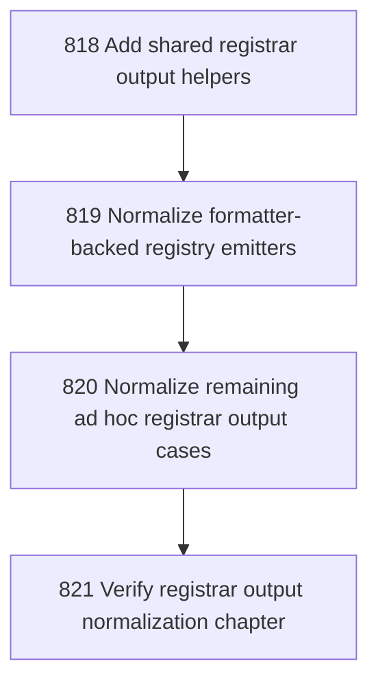

# Registrar Output Normalization

## Goal

<!-- Goal placeholder -->

## DAG

## Active Tasks

| # | Task | Name | Purpose |
|---|------|------|---------|
| 1 | 818 | Add shared registrar output helpers | Create shared helpers for registrar-owned command result emission and silent command context construction. |
| 2 | 819 | Normalize formatter-backed registry emitters | Replace duplicated formatter-backed output/exit helpers in sites, console, and principal registrars with shared helpers. |
| 3 | 820 | Normalize remaining ad hoc registrar output cases | Apply shared output discipline where safe to product utility, workbench diagnose, and task search while preserving long-lived serve command exceptions. |
| 4 | 821 | Verify registrar output normalization chapter | Verify, close, and commit the registrar output normalization chapter. |

## CCC Posture

| Coordinate | Evidenced State | Projected State If Chapter Verifies | Pressure Path | Evidence Required |
|------------|-----------------|-------------------------------------|---------------|-------------------|
| semantic_resolution | 0 | 0 | TBD | TBD |
| invariant_preservation | 0 | 0 | TBD | TBD |
| constructive_executability | 0 | 0 | TBD | TBD |
| grounded_universalization | 0 | 0 | TBD | TBD |
| authority_reviewability | 0 | 0 | TBD | TBD |
| teleological_pressure | 0 | 0 | TBD | TBD |

## Deferred Work

| Deferred Capability | Rationale |
|---------------------|-----------|
| **TBD** | TBD |

## Closure Criteria

- [ ] All tasks in this chapter are closed or confirmed.
- [ ] Semantic drift check passes.
- [ ] Gap table produced.
- [ ] CCC posture recorded.
