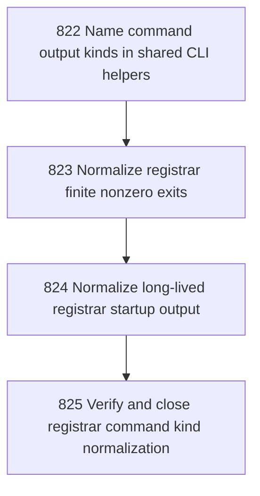

# Registrar Command Kind Normalization

## Goal

<!-- Goal placeholder -->

## DAG

## Active Tasks

| # | Task | Name | Purpose |
|---|------|------|---------|
| 1 | 822 | Name command output kinds in shared CLI helpers | Make finite command and long-lived command output authority explicit instead of relying on scattered process/console conventions. |
| 2 | 823 | Normalize registrar finite nonzero exits | Remove remaining registrar-owned direct process.exit/console.error branches for finite commands where safe. |
| 3 | 824 | Normalize long-lived registrar startup output | Make console and workbench serve command output use a named long-lived process startup helper. |
| 4 | 825 | Verify and close registrar command kind normalization | Prove the chapter removed informal registrar output exceptions without destabilizing CLI registration. |

## CCC Posture

| Coordinate | Evidenced State | Projected State If Chapter Verifies | Pressure Path | Evidence Required |
|------------|-----------------|-------------------------------------|---------------|-------------------|
| semantic_resolution | 0 | 0 | TBD | TBD |
| invariant_preservation | 0 | 0 | TBD | TBD |
| constructive_executability | 0 | 0 | TBD | TBD |
| grounded_universalization | 0 | 0 | TBD | TBD |
| authority_reviewability | 0 | 0 | TBD | TBD |
| teleological_pressure | 0 | 0 | TBD | TBD |

## Deferred Work

| Deferred Capability | Rationale |
|---------------------|-----------|
| **TBD** | TBD |

## Closure Criteria

- [ ] All tasks in this chapter are closed or confirmed.
- [ ] Semantic drift check passes.
- [ ] Gap table produced.
- [ ] CCC posture recorded.
