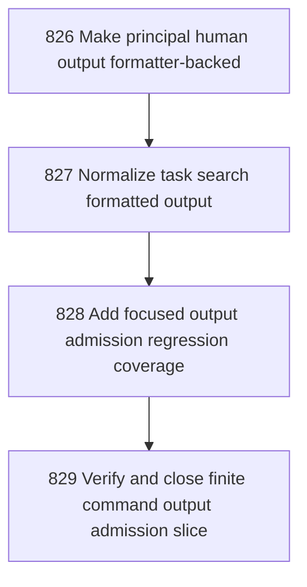

# Finite Command Output Admission Slice

## Goal

<!-- Goal placeholder -->

## DAG

## Active Tasks

| # | Task | Name | Purpose |
|---|------|------|---------|
| 1 | 826 | Make principal human output formatter-backed | Move principal status/list/attach/detach human output from direct console writes into returned formatted command results. |
| 2 | 827 | Normalize task search formatted output | Remove direct console writes from task-search.ts by returning formatted search output as a command result. |
| 3 | 828 | Add focused output admission regression coverage | Add tests or focused static checks proving principal and task search output is returned, not directly printed. |
| 4 | 829 | Verify and close finite command output admission slice | Close the chapter with bounded verification and a clean commit. |

## CCC Posture

| Coordinate | Evidenced State | Projected State If Chapter Verifies | Pressure Path | Evidence Required |
|------------|-----------------|-------------------------------------|---------------|-------------------|
| semantic_resolution | 0 | 0 | TBD | TBD |
| invariant_preservation | 0 | 0 | TBD | TBD |
| constructive_executability | 0 | 0 | TBD | TBD |
| grounded_universalization | 0 | 0 | TBD | TBD |
| authority_reviewability | 0 | 0 | TBD | TBD |
| teleological_pressure | 0 | 0 | TBD | TBD |

## Deferred Work

| Deferred Capability | Rationale |
|---------------------|-----------|
| **TBD** | TBD |

## Closure Criteria

- [ ] All tasks in this chapter are closed or confirmed.
- [ ] Semantic drift check passes.
- [ ] Gap table produced.
- [ ] CCC posture recorded.
