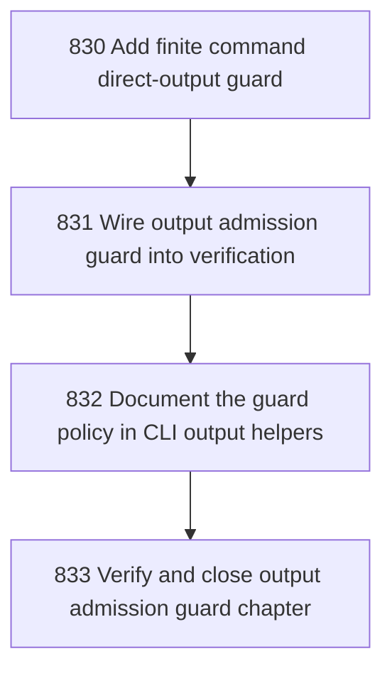

# Output Admission Guard

## Goal

<!-- Goal placeholder -->

## DAG

## Active Tasks

| # | Task | Name | Purpose |
|---|------|------|---------|
| 1 | 830 | Add finite command direct-output guard | Introduce a static guard that prevents new direct console/process output in CLI command implementation files unless explicitly allowlisted. |
| 2 | 831 | Wire output admission guard into verification | Make finite command output admission enforcement part of the normal fast verification path. |
| 3 | 832 | Document the guard policy in CLI output helpers | Make the intended path for finite output construction clear to future command authors. |
| 4 | 833 | Verify and close output admission guard chapter | Prove the guard is active, bounded, and compatible with the current repository. |

## CCC Posture

| Coordinate | Evidenced State | Projected State If Chapter Verifies | Pressure Path | Evidence Required |
|------------|-----------------|-------------------------------------|---------------|-------------------|
| semantic_resolution | 0 | 0 | TBD | TBD |
| invariant_preservation | 0 | 0 | TBD | TBD |
| constructive_executability | 0 | 0 | TBD | TBD |
| grounded_universalization | 0 | 0 | TBD | TBD |
| authority_reviewability | 0 | 0 | TBD | TBD |
| teleological_pressure | 0 | 0 | TBD | TBD |

## Deferred Work

| Deferred Capability | Rationale |
|---------------------|-----------|
| **TBD** | TBD |

## Closure Criteria

- [ ] All tasks in this chapter are closed or confirmed.
- [ ] Semantic drift check passes.
- [ ] Gap table produced.
- [ ] CCC posture recorded.
