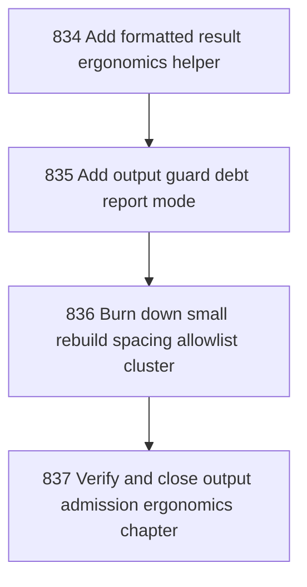

# Output Admission Ergonomics

## Goal

<!-- Goal placeholder -->

## DAG

## Active Tasks

| # | Task | Name | Purpose |
|---|------|------|---------|
| 1 | 834 | Add formatted result ergonomics helper | Give command implementations one obvious helper for returning human formatted output without direct stdout writes. |
| 2 | 835 | Add output guard debt report mode | Make the output admission guard report remaining allowlist debt by file and count without failing. |
| 3 | 836 | Burn down small rebuild spacing allowlist cluster | Remove the easy rebuild-views/rebuild-projections blank-line direct output allowances by returning formatted output instead. |
| 4 | 837 | Verify and close output admission ergonomics chapter | Close the ergonomics chapter with guard, report, typecheck/build, full verify, and commit. |

## CCC Posture

| Coordinate | Evidenced State | Projected State If Chapter Verifies | Pressure Path | Evidence Required |
|------------|-----------------|-------------------------------------|---------------|-------------------|
| semantic_resolution | 0 | 0 | TBD | TBD |
| invariant_preservation | 0 | 0 | TBD | TBD |
| constructive_executability | 0 | 0 | TBD | TBD |
| grounded_universalization | 0 | 0 | TBD | TBD |
| authority_reviewability | 0 | 0 | TBD | TBD |
| teleological_pressure | 0 | 0 | TBD | TBD |

## Deferred Work

| Deferred Capability | Rationale |
|---------------------|-----------|
| **TBD** | TBD |

## Closure Criteria

- [ ] All tasks in this chapter are closed or confirmed.
- [ ] Semantic drift check passes.
- [ ] Gap table produced.
- [ ] CCC posture recorded.
