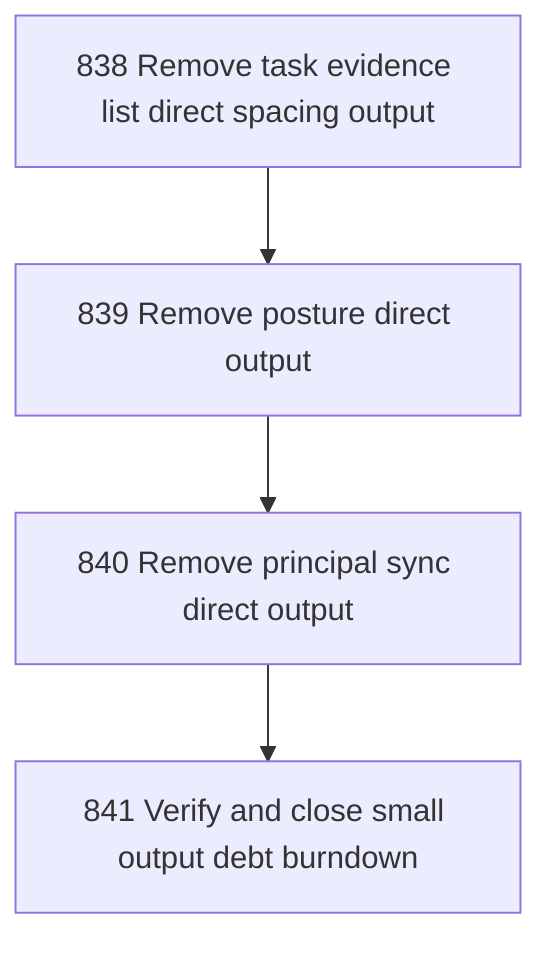

# Small Output Debt Burndown

## Goal

<!-- Goal placeholder -->

## DAG

## Active Tasks

| # | Task | Name | Purpose |
|---|------|------|---------|
| 1 | 838 | Remove task evidence list direct spacing output | Remove the remaining direct console output allowance from task-evidence-list without changing evidence behavior. |
| 2 | 839 | Remove posture direct output | Remove the posture command's direct counterweight intent console output allowance. |
| 3 | 840 | Remove principal sync direct output | Remove principal-sync-from-tasks direct divergence row output allowance. |
| 4 | 841 | Verify and close small output debt burndown | Verify the three small allowlist clusters are gone, close chapter tasks, and commit. |

## CCC Posture

| Coordinate | Evidenced State | Projected State If Chapter Verifies | Pressure Path | Evidence Required |
|------------|-----------------|-------------------------------------|---------------|-------------------|
| semantic_resolution | 0 | 0 | TBD | TBD |
| invariant_preservation | 0 | 0 | TBD | TBD |
| constructive_executability | 0 | 0 | TBD | TBD |
| grounded_universalization | 0 | 0 | TBD | TBD |
| authority_reviewability | 0 | 0 | TBD | TBD |
| teleological_pressure | 0 | 0 | TBD | TBD |

## Deferred Work

| Deferred Capability | Rationale |
|---------------------|-----------|
| **TBD** | TBD |

## Closure Criteria

- [ ] All tasks in this chapter are closed or confirmed.
- [ ] Semantic drift check passes.
- [ ] Gap table produced.
- [ ] CCC posture recorded.
