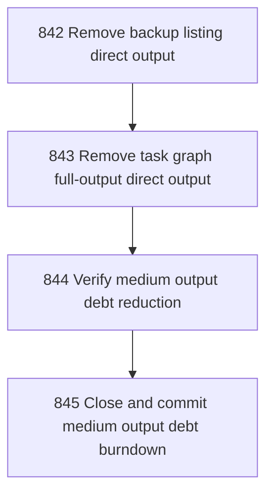

# Medium Output Debt Burndown

## Goal

<!-- Goal placeholder -->

## DAG

## Active Tasks

| # | Task | Name | Purpose |
|---|------|------|---------|
| 1 | 842 | Remove backup listing direct output | Remove backup-ls direct console output by routing blank spacing and type summary rows through Formatter. |
| 2 | 843 | Remove task graph full-output direct output | Remove task-graph direct console output used for explicit full Mermaid mode. |
| 3 | 844 | Verify medium output debt reduction | Prove backup-ls and task-graph output debt was removed with bounded checks. |
| 4 | 845 | Close and commit medium output debt burndown | Close chapter tasks, run full verification, and commit the medium output debt burndown. |

## CCC Posture

| Coordinate | Evidenced State | Projected State If Chapter Verifies | Pressure Path | Evidence Required |
|------------|-----------------|-------------------------------------|---------------|-------------------|
| semantic_resolution | 0 | 0 | TBD | TBD |
| invariant_preservation | 0 | 0 | TBD | TBD |
| constructive_executability | 0 | 0 | TBD | TBD |
| grounded_universalization | 0 | 0 | TBD | TBD |
| authority_reviewability | 0 | 0 | TBD | TBD |
| teleological_pressure | 0 | 0 | TBD | TBD |

## Deferred Work

| Deferred Capability | Rationale |
|---------------------|-----------|
| **TBD** | TBD |

## Closure Criteria

- [ ] All tasks in this chapter are closed or confirmed.
- [ ] Semantic drift check passes.
- [ ] Gap table produced.
- [ ] CCC posture recorded.
