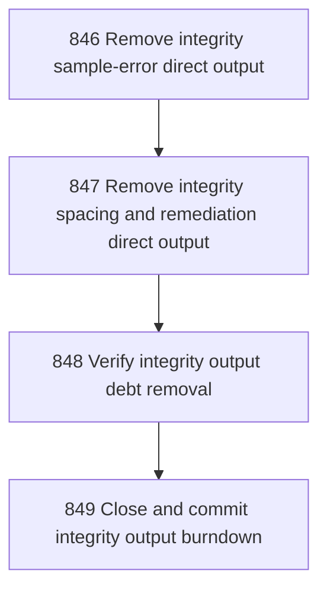

# Integrity Output Debt Burndown

## Goal

<!-- Goal placeholder -->

## DAG

## Active Tasks

| # | Task | Name | Purpose |
|---|------|------|---------|
| 1 | 846 | Remove integrity sample-error direct output | Route integrity sample-error rows through Formatter instead of direct console output. |
| 2 | 847 | Remove integrity spacing and remediation direct output | Remove remaining direct blank-line and remediation command output from integrity.ts. |
| 3 | 848 | Verify integrity output debt removal | Prove integrity output debt is gone with bounded static and command checks. |
| 4 | 849 | Close and commit integrity output burndown | Close the chapter, run full verification, and commit the integrity output burndown. |

## CCC Posture

| Coordinate | Evidenced State | Projected State If Chapter Verifies | Pressure Path | Evidence Required |
|------------|-----------------|-------------------------------------|---------------|-------------------|
| semantic_resolution | 0 | 0 | TBD | TBD |
| invariant_preservation | 0 | 0 | TBD | TBD |
| constructive_executability | 0 | 0 | TBD | TBD |
| grounded_universalization | 0 | 0 | TBD | TBD |
| authority_reviewability | 0 | 0 | TBD | TBD |
| teleological_pressure | 0 | 0 | TBD | TBD |

## Deferred Work

| Deferred Capability | Rationale |
|---------------------|-----------|
| **TBD** | TBD |

## Closure Criteria

- [ ] All tasks in this chapter are closed or confirmed.
- [ ] Semantic drift check passes.
- [ ] Gap table produced.
- [ ] CCC posture recorded.
