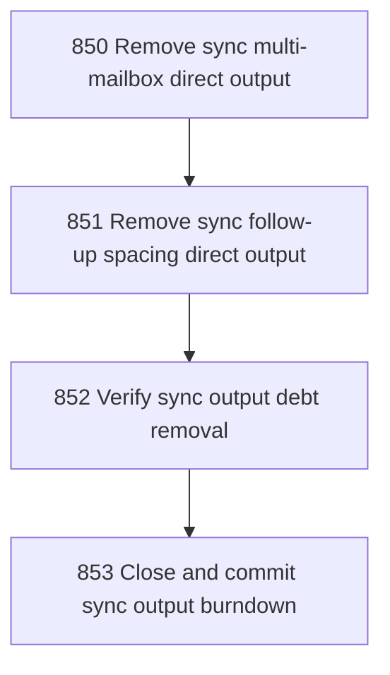

# Sync Output Debt Burndown

## Goal

<!-- Goal placeholder -->

## DAG

## Active Tasks

| # | Task | Name | Purpose |
|---|------|------|---------|
| 1 | 850 | Remove sync multi-mailbox direct output | Route multi-mailbox sync human summary through Formatter instead of direct console output. |
| 2 | 851 | Remove sync follow-up spacing direct output | Replace sync.ts direct blank-line output with Formatter output. |
| 3 | 852 | Verify sync output debt removal | Prove sync output debt is gone with bounded checks. |
| 4 | 853 | Close and commit sync output burndown | Close the chapter, run full verification, and commit the sync output burndown. |

## CCC Posture

| Coordinate | Evidenced State | Projected State If Chapter Verifies | Pressure Path | Evidence Required |
|------------|-----------------|-------------------------------------|---------------|-------------------|
| semantic_resolution | 0 | 0 | TBD | TBD |
| invariant_preservation | 0 | 0 | TBD | TBD |
| constructive_executability | 0 | 0 | TBD | TBD |
| grounded_universalization | 0 | 0 | TBD | TBD |
| authority_reviewability | 0 | 0 | TBD | TBD |
| teleological_pressure | 0 | 0 | TBD | TBD |

## Deferred Work

| Deferred Capability | Rationale |
|---------------------|-----------|
| **TBD** | TBD |

## Closure Criteria

- [ ] All tasks in this chapter are closed or confirmed.
- [ ] Semantic drift check passes.
- [ ] Gap table produced.
- [ ] CCC posture recorded.
