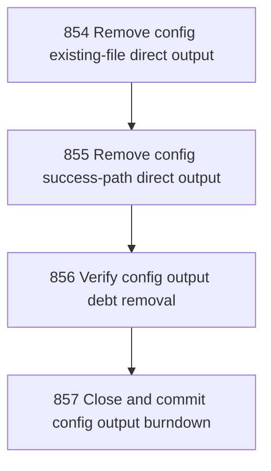

# Config Output Debt Burndown

## Goal

<!-- Goal placeholder -->

## DAG

## Active Tasks

| # | Task | Name | Purpose |
|---|------|------|---------|
| 1 | 854 | Remove config existing-file direct output | Route non-interactive config existing-file remediation output through Formatter instead of direct console output. |
| 2 | 855 | Remove config success-path direct output | Route non-interactive config success-path blank-line and quick-start output through Formatter. |
| 3 | 856 | Verify config output debt removal | Prove non-interactive config output debt is gone with bounded checks. |
| 4 | 857 | Close and commit config output burndown | Close the chapter, run full verification, and commit the config output burndown. |

## CCC Posture

| Coordinate | Evidenced State | Projected State If Chapter Verifies | Pressure Path | Evidence Required |
|------------|-----------------|-------------------------------------|---------------|-------------------|
| semantic_resolution | 0 | 0 | TBD | TBD |
| invariant_preservation | 0 | 0 | TBD | TBD |
| constructive_executability | 0 | 0 | TBD | TBD |
| grounded_universalization | 0 | 0 | TBD | TBD |
| authority_reviewability | 0 | 0 | TBD | TBD |
| teleological_pressure | 0 | 0 | TBD | TBD |

## Deferred Work

| Deferred Capability | Rationale |
|---------------------|-----------|
| **TBD** | TBD |

## Closure Criteria

- [ ] All tasks in this chapter are closed or confirmed.
- [ ] Semantic drift check passes.
- [ ] Gap table produced.
- [ ] CCC posture recorded.
