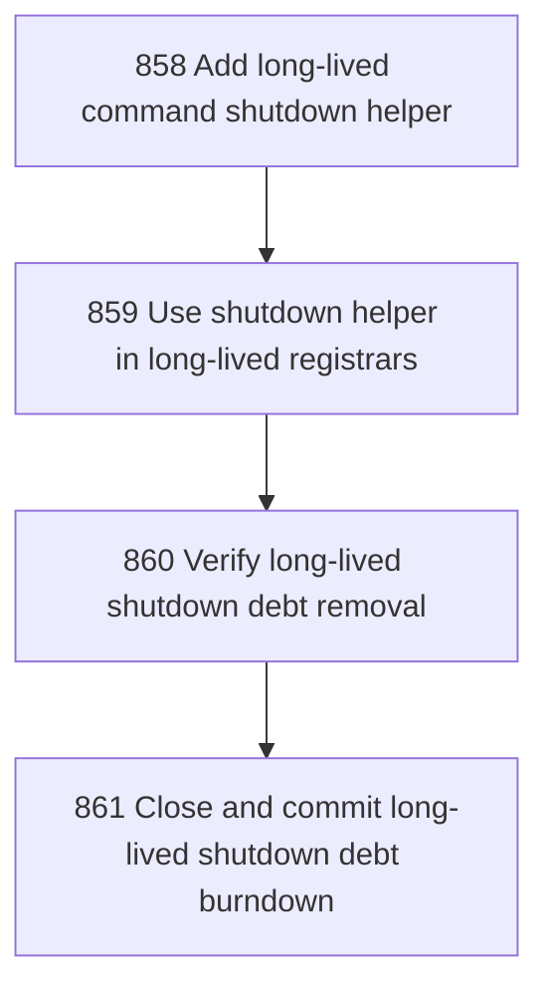

# Long-lived Shutdown Output Debt Burndown

## Goal

<!-- Goal placeholder -->

## DAG

## Active Tasks

| # | Task | Name | Purpose |
|---|------|------|---------|
| 1 | 858 | Add long-lived command shutdown helper | Represent long-lived command shutdown as a named helper instead of raw process.exit calls in command registrars. |
| 2 | 859 | Use shutdown helper in long-lived registrars | Replace raw process.exit(0) in console and workbench serve handlers with the named shutdown helper. |
| 3 | 860 | Verify long-lived shutdown debt removal | Prove long-lived shutdown direct-output debt is gone with bounded checks. |
| 4 | 861 | Close and commit long-lived shutdown debt burndown | Close the chapter, run full verification, and commit the long-lived shutdown debt burndown. |

## CCC Posture

| Coordinate | Evidenced State | Projected State If Chapter Verifies | Pressure Path | Evidence Required |
|------------|-----------------|-------------------------------------|---------------|-------------------|
| semantic_resolution | 0 | 0 | TBD | TBD |
| invariant_preservation | 0 | 0 | TBD | TBD |
| constructive_executability | 0 | 0 | TBD | TBD |
| grounded_universalization | 0 | 0 | TBD | TBD |
| authority_reviewability | 0 | 0 | TBD | TBD |
| teleological_pressure | 0 | 0 | TBD | TBD |

## Deferred Work

| Deferred Capability | Rationale |
|---------------------|-----------|
| **TBD** | TBD |

## Closure Criteria

- [ ] All tasks in this chapter are closed or confirmed.
- [ ] Semantic drift check passes.
- [ ] Gap table produced.
- [ ] CCC posture recorded.
