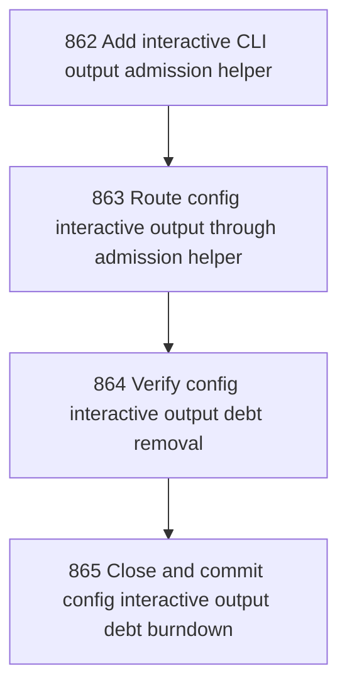

# Config Interactive Output Debt Burndown

## Goal

<!-- Goal placeholder -->

## DAG

## Active Tasks

| # | Task | Name | Purpose |
|---|------|------|---------|
| 1 | 862 | Add interactive CLI output admission helper | Create a named helper for bounded interactive command follow-up lines so interactive prompts do not need command-local raw console output. |
| 2 | 863 | Route config interactive output through admission helper | Remove direct console output and raw cancellation exit from config-interactive.ts by routing through sanctioned helper surfaces. |
| 3 | 864 | Verify config interactive output debt removal | Prove the CLI output admission guard no longer needs any config-interactive.ts allowlist entries. |
| 4 | 865 | Close and commit config interactive output debt burndown | Close the chapter with evidence and commit the bounded cleanup. |

## CCC Posture

| Coordinate | Evidenced State | Projected State If Chapter Verifies | Pressure Path | Evidence Required |
|------------|-----------------|-------------------------------------|---------------|-------------------|
| semantic_resolution | 0 | 0 | TBD | TBD |
| invariant_preservation | 0 | 0 | TBD | TBD |
| constructive_executability | 0 | 0 | TBD | TBD |
| grounded_universalization | 0 | 0 | TBD | TBD |
| authority_reviewability | 0 | 0 | TBD | TBD |
| teleological_pressure | 0 | 0 | TBD | TBD |

## Deferred Work

| Deferred Capability | Rationale |
|---------------------|-----------|
| **TBD** | TBD |

## Closure Criteria

- [ ] All tasks in this chapter are closed or confirmed.
- [ ] Semantic drift check passes.
- [ ] Gap table produced.
- [ ] CCC posture recorded.
