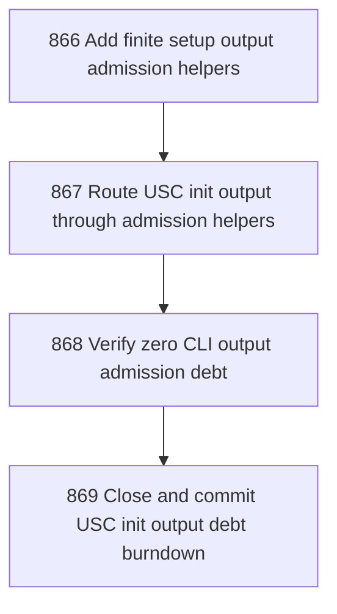

# USC Init Output Debt Burndown

## Goal

<!-- Goal placeholder -->

## DAG

## Active Tasks

| # | Task | Name | Purpose |
|---|------|------|---------|
| 1 | 866 | Add finite setup output admission helpers | Create shared CLI output helpers for bounded finite setup progress and validation diagnostics. |
| 2 | 867 | Route USC init output through admission helpers | Remove command-local direct stdout and stderr output from usc-init.ts without changing its visible human output. |
| 3 | 868 | Verify zero CLI output admission debt | Prove no command implementation requires direct-output allowlist entries. |
| 4 | 869 | Close and commit USC init output debt burndown | Close the chapter with evidence and commit the final CLI output admission cleanup. |

## CCC Posture

| Coordinate | Evidenced State | Projected State If Chapter Verifies | Pressure Path | Evidence Required |
|------------|-----------------|-------------------------------------|---------------|-------------------|
| semantic_resolution | 0 | 0 | TBD | TBD |
| invariant_preservation | 0 | 0 | TBD | TBD |
| constructive_executability | 0 | 0 | TBD | TBD |
| grounded_universalization | 0 | 0 | TBD | TBD |
| authority_reviewability | 0 | 0 | TBD | TBD |
| teleological_pressure | 0 | 0 | TBD | TBD |

## Deferred Work

| Deferred Capability | Rationale |
|---------------------|-----------|
| **TBD** | TBD |

## Closure Criteria

- [ ] All tasks in this chapter are closed or confirmed.
- [ ] Semantic drift check passes.
- [ ] Gap table produced.
- [ ] CCC posture recorded.
