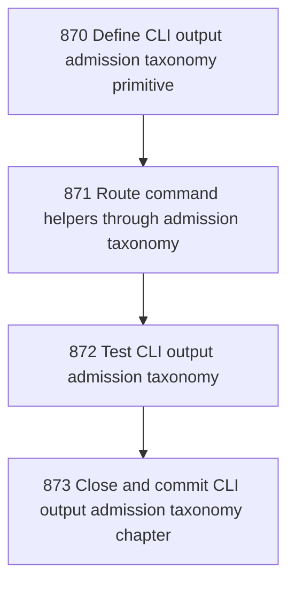

# CLI Output Admission Taxonomy

## Goal

<!-- Goal placeholder -->

## DAG

## Active Tasks

| # | Task | Name | Purpose |
|---|------|------|---------|
| 1 | 870 | Define CLI output admission taxonomy primitive | Introduce a small shared primitive that names the output admission zone and stream explicitly. |
| 2 | 871 | Route command helpers through admission taxonomy | Make long-lived, interactive, finite progress, and diagnostic helpers delegate through the same admission primitive. |
| 3 | 872 | Test CLI output admission taxonomy | Add focused tests proving stdout/stderr routing and exit-code admission without command-local console output. |
| 4 | 873 | Close and commit CLI output admission taxonomy chapter | Close the taxonomy cleanup chapter with evidence and commit it. |

## CCC Posture

| Coordinate | Evidenced State | Projected State If Chapter Verifies | Pressure Path | Evidence Required |
|------------|-----------------|-------------------------------------|---------------|-------------------|
| semantic_resolution | 0 | 0 | TBD | TBD |
| invariant_preservation | 0 | 0 | TBD | TBD |
| constructive_executability | 0 | 0 | TBD | TBD |
| grounded_universalization | 0 | 0 | TBD | TBD |
| authority_reviewability | 0 | 0 | TBD | TBD |
| teleological_pressure | 0 | 0 | TBD | TBD |

## Deferred Work

| Deferred Capability | Rationale |
|---------------------|-----------|
| **TBD** | TBD |

## Closure Criteria

- [ ] All tasks in this chapter are closed or confirmed.
- [ ] Semantic drift check passes.
- [ ] Gap table produced.
- [ ] CCC posture recorded.
