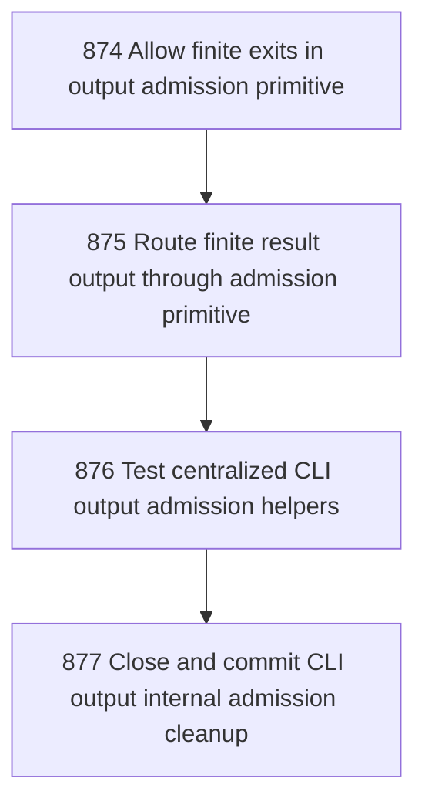

# CLI Output Internal Admission Cleanup

## Goal

<!-- Goal placeholder -->

## DAG

## Active Tasks

| # | Task | Name | Purpose |
|---|------|------|---------|
| 1 | 874 | Allow finite exits in output admission primitive | Extend the CLI output exit admission primitive so finite command exits use the same centralized exit path as interactive and long-lived commands. |
| 2 | 875 | Route finite result output through admission primitive | Make finite command result helpers use emitCliOutputAdmission for stdout and stderr instead of raw console writes. |
| 3 | 876 | Test centralized CLI output admission helpers | Expand focused tests to prove finite result, failure, and formatter-backed paths route through centralized admission behavior. |
| 4 | 877 | Close and commit CLI output internal admission cleanup | Close the chapter with evidence and commit the internal output-admission consistency cleanup. |

## CCC Posture

| Coordinate | Evidenced State | Projected State If Chapter Verifies | Pressure Path | Evidence Required |
|------------|-----------------|-------------------------------------|---------------|-------------------|
| semantic_resolution | 0 | 0 | TBD | TBD |
| invariant_preservation | 0 | 0 | TBD | TBD |
| constructive_executability | 0 | 0 | TBD | TBD |
| grounded_universalization | 0 | 0 | TBD | TBD |
| authority_reviewability | 0 | 0 | TBD | TBD |
| teleological_pressure | 0 | 0 | TBD | TBD |

## Deferred Work

| Deferred Capability | Rationale |
|---------------------|-----------|
| **TBD** | TBD |

## Closure Criteria

- [ ] All tasks in this chapter are closed or confirmed.
- [ ] Semantic drift check passes.
- [ ] Gap table produced.
- [ ] CCC posture recorded.
