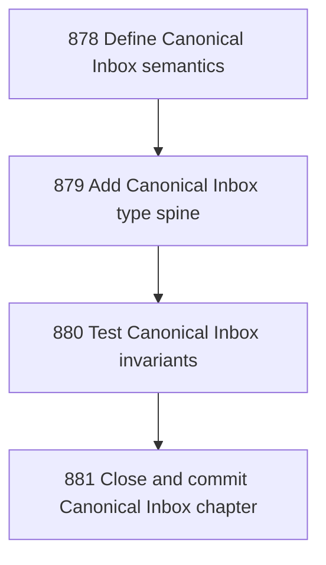

# Canonical Inbox Typed Envelope Intake Zone

## Goal

<!-- Goal placeholder -->

## DAG

## Active Tasks

| # | Task | Name | Purpose |
|---|------|------|---------|
| 1 | 878 | Define Canonical Inbox semantics | Document Canonical Inbox as Narada's typed envelope intake zone, distinct from email mailbox and from task/action authority. |
| 2 | 879 | Add Canonical Inbox type spine | Add exported control-plane types for Canonical Inbox envelopes, source, kind, authority, status, and promotion. |
| 3 | 880 | Test Canonical Inbox invariants | Add focused tests proving canonical inbox classification and inertness invariants at the type-helper layer. |
| 4 | 881 | Close and commit Canonical Inbox chapter | Close the Canonical Inbox chapter with verification evidence and commit it. |

## CCC Posture

| Coordinate | Evidenced State | Projected State If Chapter Verifies | Pressure Path | Evidence Required |
|------------|-----------------|-------------------------------------|---------------|-------------------|
| semantic_resolution | 0 | 0 | TBD | TBD |
| invariant_preservation | 0 | 0 | TBD | TBD |
| constructive_executability | 0 | 0 | TBD | TBD |
| grounded_universalization | 0 | 0 | TBD | TBD |
| authority_reviewability | 0 | 0 | TBD | TBD |
| teleological_pressure | 0 | 0 | TBD | TBD |

## Deferred Work

| Deferred Capability | Rationale |
|---------------------|-----------|
| **TBD** | TBD |

## Closure Criteria

- [ ] All tasks in this chapter are closed or confirmed.
- [ ] Semantic drift check passes.
- [ ] Gap table produced.
- [ ] CCC posture recorded.
