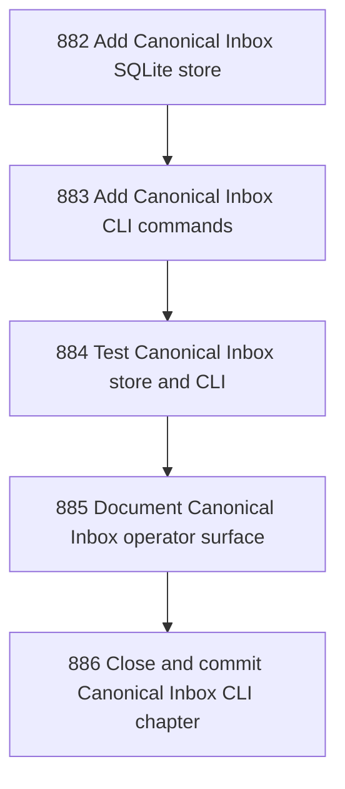

# Canonical Inbox CLI and Store

## Goal

<!-- Goal placeholder -->

## DAG

## Active Tasks

| # | Task | Name | Purpose |
|---|------|------|---------|
| 1 | 882 | Add Canonical Inbox SQLite store | Persist InboxEnvelope records in a small SQLite store with submit, list, get, and promote operations. |
| 2 | 883 | Add Canonical Inbox CLI commands | Expose narada inbox submit/list/show/promote as bounded command surfaces over the SQLite store. |
| 3 | 884 | Test Canonical Inbox store and CLI | Add focused tests for store invariants and CLI command behavior. |
| 4 | 885 | Document Canonical Inbox operator surface | Document the initial CLI surface and the inert-envelope promotion invariant. |
| 5 | 886 | Close and commit Canonical Inbox CLI chapter | Close the chapter with verification evidence and commit it. |

## CCC Posture

| Coordinate | Evidenced State | Projected State If Chapter Verifies | Pressure Path | Evidence Required |
|------------|-----------------|-------------------------------------|---------------|-------------------|
| semantic_resolution | 0 | 0 | TBD | TBD |
| invariant_preservation | 0 | 0 | TBD | TBD |
| constructive_executability | 0 | 0 | TBD | TBD |
| grounded_universalization | 0 | 0 | TBD | TBD |
| authority_reviewability | 0 | 0 | TBD | TBD |
| teleological_pressure | 0 | 0 | TBD | TBD |

## Deferred Work

| Deferred Capability | Rationale |
|---------------------|-----------|
| **TBD** | TBD |

## Closure Criteria

- [ ] All tasks in this chapter are closed or confirmed.
- [ ] Semantic drift check passes.
- [ ] Gap table produced.
- [ ] CCC posture recorded.
