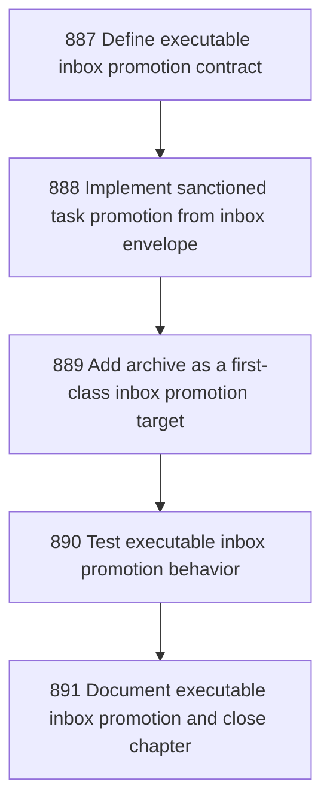

# Canonical Inbox Executable Promotion

## Goal

<!-- Goal placeholder -->

## DAG

## Active Tasks

| # | Task | Name | Purpose |
|---|------|------|---------|
| 1 | 887 | Define executable inbox promotion contract | Replace metadata-only promotion ambiguity with a durable contract that distinguishes recorded promotion from enacted target-zone mutation. |
| 2 | 888 | Implement sanctioned task promotion from inbox envelope | Make inbox task promotion call the task-authoring command path instead of only recording target metadata. |
| 3 | 889 | Add archive as a first-class inbox promotion target | Provide a non-mutating target crossing for envelopes that should leave the active inbox without being converted to work. |
| 4 | 890 | Test executable inbox promotion behavior | Cover executable promotion and idempotence so Inbox cannot silently drift back to metadata-only behavior. |
| 5 | 891 | Document executable inbox promotion and close chapter | Update operator-facing docs and close this chapter with evidence so the new crossing is understandable and governed. |

## CCC Posture

| Coordinate | Evidenced State | Projected State If Chapter Verifies | Pressure Path | Evidence Required |
|------------|-----------------|-------------------------------------|---------------|-------------------|
| semantic_resolution | 0 | 0 | TBD | TBD |
| invariant_preservation | 0 | 0 | TBD | TBD |
| constructive_executability | 0 | 0 | TBD | TBD |
| grounded_universalization | 0 | 0 | TBD | TBD |
| authority_reviewability | 0 | 0 | TBD | TBD |
| teleological_pressure | 0 | 0 | TBD | TBD |

## Deferred Work

| Deferred Capability | Rationale |
|---------------------|-----------|
| **TBD** | TBD |

## Closure Criteria

- [ ] All tasks in this chapter are closed or confirmed.
- [ ] Semantic drift check passes.
- [ ] Gap table produced.
- [ ] CCC posture recorded.
