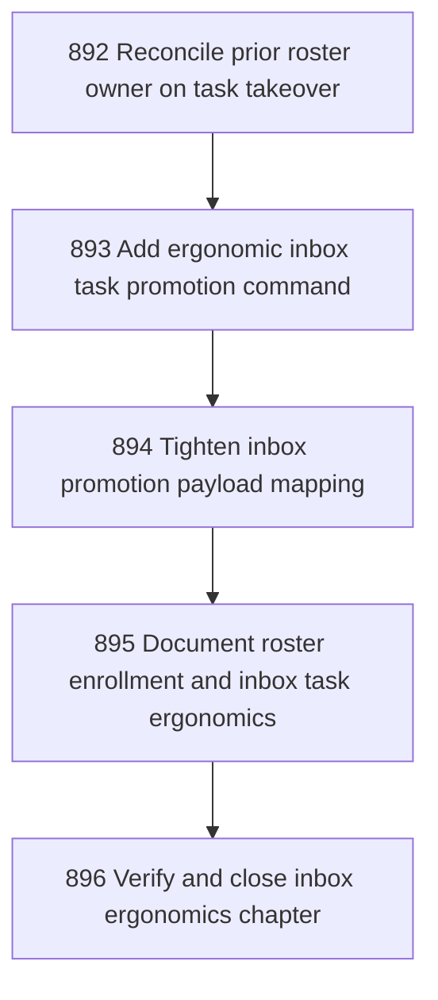

# Inbox Promotion Ergonomics and Takeover Reconciliation

## Goal

<!-- Goal placeholder -->

## DAG

## Active Tasks

| # | Task | Name | Purpose |
|---|------|------|---------|
| 1 | 892 | Reconcile prior roster owner on task takeover | Make takeover behavior internally coherent by clearing or finishing the previous active assignee when a continuation supersedes them. |
| 2 | 893 | Add ergonomic inbox task promotion command | Provide an operator-friendly inbox task promotion surface that avoids the awkward --target-kind task --target-ref pattern. |
| 3 | 894 | Tighten inbox promotion payload mapping | Make envelope-to-task mapping explicit and less surprising. |
| 4 | 895 | Document roster enrollment and inbox task ergonomics | Make the new sanctioned operator paths visible so direct roster edits and awkward promotion invocations do not reappear. |
| 5 | 896 | Verify and close inbox ergonomics chapter | Close the chapter with durable evidence, fast verification, commit, and push. |

## CCC Posture

| Coordinate | Evidenced State | Projected State If Chapter Verifies | Pressure Path | Evidence Required |
|------------|-----------------|-------------------------------------|---------------|-------------------|
| semantic_resolution | 0 | 0 | TBD | TBD |
| invariant_preservation | 0 | 0 | TBD | TBD |
| constructive_executability | 0 | 0 | TBD | TBD |
| grounded_universalization | 0 | 0 | TBD | TBD |
| authority_reviewability | 0 | 0 | TBD | TBD |
| teleological_pressure | 0 | 0 | TBD | TBD |

## Deferred Work

| Deferred Capability | Rationale |
|---------------------|-----------|
| **TBD** | TBD |

## Closure Criteria

- [ ] All tasks in this chapter are closed or confirmed.
- [ ] Semantic drift check passes.
- [ ] Gap table produced.
- [ ] CCC posture recorded.
