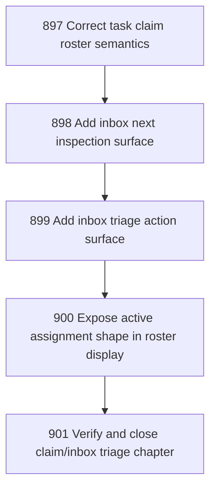

# Claim Roster and Inbox Triage Coherence

## Goal

<!-- Goal placeholder -->

## DAG

## Active Tasks

| # | Task | Name | Purpose |
|---|------|------|---------|
| 1 | 897 | Correct task claim roster semantics | Remove the stale claim/roster asymmetry by making the documented contract match the implemented command behavior and covering it with tests. |
| 2 | 898 | Add inbox next inspection surface | Give operators and agents a bounded way to see the next inbox item without listing or reading the whole inbox. |
| 3 | 899 | Add inbox triage action surface | Provide ergonomic one-step handling for the next envelope while preserving explicit governed actions. |
| 4 | 900 | Expose active assignment shape in roster display | Make roster output less misleading when multiple agents are associated with one task. |
| 5 | 901 | Verify and close claim/inbox triage chapter | Close the chapter with focused tests, fast verification, commit, and push. |

## CCC Posture

| Coordinate | Evidenced State | Projected State If Chapter Verifies | Pressure Path | Evidence Required |
|------------|-----------------|-------------------------------------|---------------|-------------------|
| semantic_resolution | 0 | 0 | TBD | TBD |
| invariant_preservation | 0 | 0 | TBD | TBD |
| constructive_executability | 0 | 0 | TBD | TBD |
| grounded_universalization | 0 | 0 | TBD | TBD |
| authority_reviewability | 0 | 0 | TBD | TBD |
| teleological_pressure | 0 | 0 | TBD | TBD |

## Deferred Work

| Deferred Capability | Rationale |
|---------------------|-----------|
| **TBD** | TBD |

## Closure Criteria

- [ ] All tasks in this chapter are closed or confirmed.
- [ ] Semantic drift check passes.
- [ ] Gap table produced.
- [ ] CCC posture recorded.
