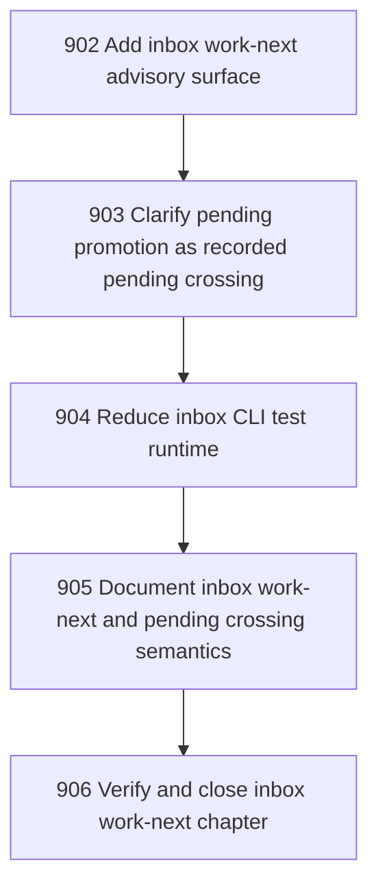

# Inbox Work-Next and Pending Crossing Coherence

## Goal

<!-- Goal placeholder -->

## DAG

## Active Tasks

| # | Task | Name | Purpose |
|---|------|------|---------|
| 1 | 902 | Add inbox work-next advisory surface | Return the next inbox envelope together with admissible actions so agents do not have to infer legal handling manually. |
| 2 | 903 | Clarify pending promotion as recorded pending crossing | Remove ambiguity between enacted promotion and pending crossing record for target zones that do not yet have executable operators. |
| 3 | 904 | Reduce inbox CLI test runtime | Improve agent loop ergonomics by keeping inbox focused tests fast while preserving coverage. |
| 4 | 905 | Document inbox work-next and pending crossing semantics | Make the operator-facing workflow clear: inspect work-next, choose admissible action, then triage/promote. |
| 5 | 906 | Verify and close inbox work-next chapter | Close the chapter with focused tests, fast verification, commit, and push. |

## CCC Posture

| Coordinate | Evidenced State | Projected State If Chapter Verifies | Pressure Path | Evidence Required |
|------------|-----------------|-------------------------------------|---------------|-------------------|
| semantic_resolution | 0 | 0 | TBD | TBD |
| invariant_preservation | 0 | 0 | TBD | TBD |
| constructive_executability | 0 | 0 | TBD | TBD |
| grounded_universalization | 0 | 0 | TBD | TBD |
| authority_reviewability | 0 | 0 | TBD | TBD |
| teleological_pressure | 0 | 0 | TBD | TBD |

## Deferred Work

| Deferred Capability | Rationale |
|---------------------|-----------|
| **TBD** | TBD |

## Closure Criteria

- [ ] All tasks in this chapter are closed or confirmed.
- [ ] Semantic drift check passes.
- [ ] Gap table produced.
- [ ] CCC posture recorded.
