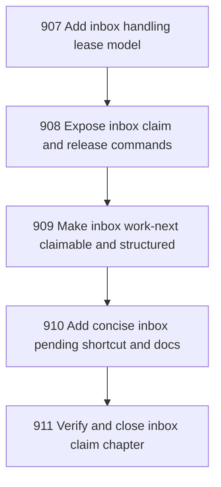

# Inbox Handling Lease and Claimable Work-Next

## Goal

<!-- Goal placeholder -->

## DAG

## Active Tasks

| # | Task | Name | Purpose |
|---|------|------|---------|
| 1 | 907 | Add inbox handling lease model | Prevent duplicate handling by adding explicit inbox claim/release semantics. |
| 2 | 908 | Expose inbox claim and release commands | Give operators and agents a sanctioned CLI path to reserve and release inbox envelopes. |
| 3 | 909 | Make inbox work-next claimable and structured | Make `work-next` suitable for agents by optionally claiming the selected envelope and returning structured action specs. |
| 4 | 910 | Add concise inbox pending shortcut and docs | Reduce pending crossing verbosity while preserving explicit target kind and target ref. |
| 5 | 911 | Verify and close inbox claim chapter | Close the chapter with focused tests, fast verification, commit, and push. |

## CCC Posture

| Coordinate | Evidenced State | Projected State If Chapter Verifies | Pressure Path | Evidence Required |
|------------|-----------------|-------------------------------------|---------------|-------------------|
| semantic_resolution | 0 | 0 | TBD | TBD |
| invariant_preservation | 0 | 0 | TBD | TBD |
| constructive_executability | 0 | 0 | TBD | TBD |
| grounded_universalization | 0 | 0 | TBD | TBD |
| authority_reviewability | 0 | 0 | TBD | TBD |
| teleological_pressure | 0 | 0 | TBD | TBD |

## Deferred Work

| Deferred Capability | Rationale |
|---------------------|-----------|
| **TBD** | TBD |

## Closure Criteria

- [ ] All tasks in this chapter are closed or confirmed.
- [ ] Semantic drift check passes.
- [ ] Gap table produced.
- [ ] CCC posture recorded.
