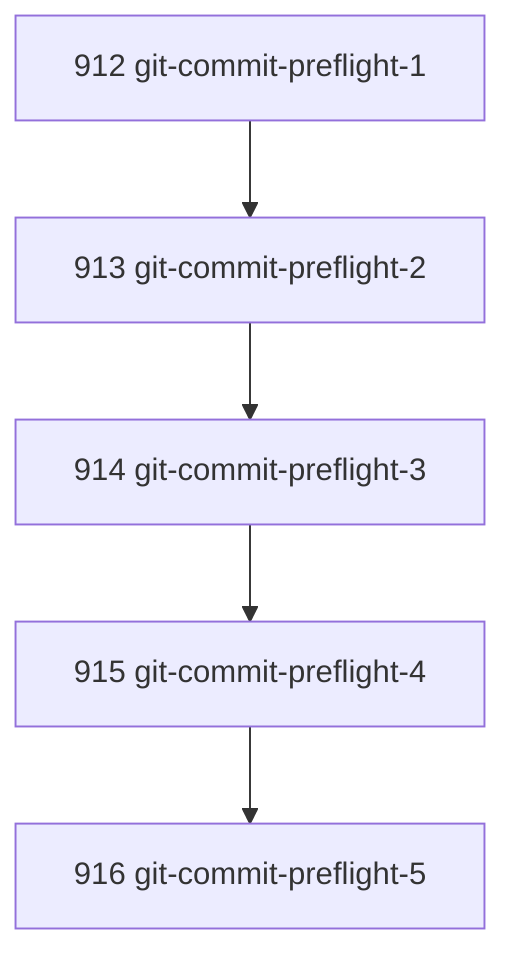

# Git Commit Authority Preflight

## Goal

Make chapter publication authority explicit before chapter work reaches the final commit/push crossing. The command must detect missing task artifacts, missing Git work tree state, unwritable Git metadata, and absent upstream push posture without mutating repository state.

## DAG

## Active Tasks

| # | Task | Name | Purpose |
|---|------|------|---------|
| 1 | 912 | Define chapter preflight contract | Separate chapter state inspection from crossing-readiness checks. |
| 2 | 913 | Implement commit authority checks | Detect Git work tree and metadata writability before commit. |
| 3 | 914 | Implement push authority checks | Detect missing upstream before push is expected. |
| 4 | 915 | Register ergonomic CLI surface | Expose one bounded read-only command with human and JSON output. |
| 5 | 916 | Verify and document usage | Add focused tests and document the operator command. |

## CCC Posture

| Coordinate | Evidenced State | Projected State If Chapter Verifies | Pressure Path | Evidence Required |
|------------|-----------------|-------------------------------------|---------------|-------------------|
| semantic_resolution | Commit failure discovered late as shell error | Commit/push readiness has named preflight checks | `chapter preflight` emits structured check names | Focused tests and CLI help |
| invariant_preservation | Git authority was implicit in agent routine | Publication crossing is checked before execution proceeds | Read-only preflight does not mutate task or Git state | Temp Git repo tests |
| constructive_executability | Agents could work a chapter then fail at `git add` | Operators can see block before work starts | `--expect-commit` and `--expect-push` options | Typecheck and focused tests |
| grounded_universalization | Specific `.git/index.lock` failure lacked general surface | Generic publication authority preflight exists | Git work tree, metadata, and upstream checks | JSON result contract |
| authority_reviewability | Failure surfaced as unstructured terminal stderr | Failure surfaces as bounded CLI result | `ready`, `status`, `checks`, remediation fields | Human and JSON command output |
| teleological_pressure | Chapter loop could stall after verified work | Chapter loop can fail early on missing commit authority | Preflight command documented in quick commands | AGENTS quick command |

## Deferred Work

| Deferred Capability | Rationale |
|---------------------|-----------|
| **Automatic chapter orchestration** | This chapter adds the preflight boundary only; a later command may compose preflight, execution, verification, commit, and push. |

## Closure Criteria

- [x] All tasks in this chapter are closed or confirmed.
- [x] Semantic drift check passes.
- [x] Gap table produced.
- [x] CCC posture recorded.

## Execution Notes

1. Added a read-only `chapter preflight <range>` operator.
2. Added explicit `--expect-commit` and `--expect-push` checks for publication crossings.
3. Registered the command under `narada chapter`.
4. Added focused tests over successful commit readiness, missing task artifacts, missing Git work tree, missing upstream, and invalid range handling.
5. Documented the command in root quick commands.

## Verification

| Check | Result |
|-------|--------|
| `pnpm --filter @narada2/cli typecheck` | Passed |
| `pnpm --filter @narada2/cli exec vitest run test/commands/chapter-preflight.test.ts --pool=forks` | Passed, 5/5 |
