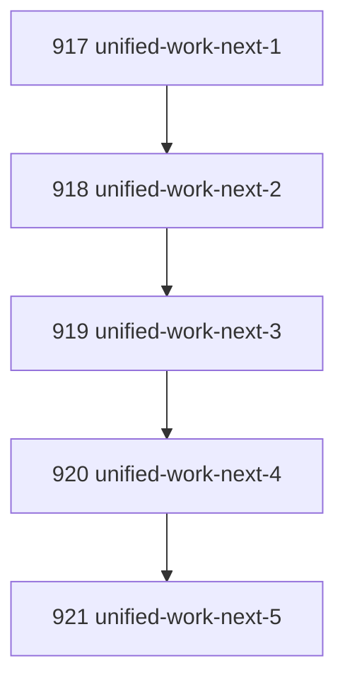

# Unified Agent Work Next Surface

## Goal

Provide one bounded command an agent/operator can run to learn the next admissible action without knowing whether work is currently in task governance, review/task execution posture, Canonical Inbox handling, or idle state.

## DAG

## Active Tasks

| # | Task | Name | Purpose |
|---|------|------|---------|
| 1 | 917 | Define unified next-action contract | Establish stable result kinds for task, inbox, and idle. |
| 2 | 918 | Compose task work-next | Preserve existing task claim/packet behavior as first priority. |
| 3 | 919 | Compose inbox work-next | Claim inbox handling only after task work is absent. |
| 4 | 920 | Register root CLI surface | Expose a short ergonomic command for agents. |
| 5 | 921 | Verify cross-zone selection | Test task-first, inbox fallback, idle, and agent admission errors. |

## CCC Posture

| Coordinate | Evidenced State | Projected State If Chapter Verifies | Pressure Path | Evidence Required |
|------------|-----------------|-------------------------------------|---------------|-------------------|
| semantic_resolution | Agents had multiple "next" surfaces | One root `work-next` surface emits typed action kind | `task_work`, `inbox_work`, `idle` result kinds | Focused command tests |
| invariant_preservation | Task and Inbox zones could be queried ad hoc | Command composes existing governed crossings without bypassing them | Delegates to task and inbox commands | Typecheck and tests |
| constructive_executability | Agents had to know subsystem ordering | Task work wins, inbox fallback, idle otherwise | Root CLI command | CLI build |
| grounded_universalization | Current pain came from task/inbox split | General next-action grammar covers current zones | Stable JSON result contract | Test fixture with task and inbox |
| authority_reviewability | "What next?" answers were not uniform | Result carries source command payload under `task_result` or `inbox_result` | Bounded JSON/human output | CLI output admission path |
| teleological_pressure | Agent loop paused on choosing the right query | Single command returns concrete next step | `narada work-next --agent <id>` | Quick command and help |

## Deferred Work

| Deferred Capability | Rationale |
|---------------------|-----------|
| **Review-specific prioritization** | This chapter unifies task execution and inbox handling. A later chapter can add explicit review work as its own action kind if review queue semantics need a distinct crossing. |

## Closure Criteria

- [x] All tasks in this chapter are closed or confirmed.
- [x] Semantic drift check passes.
- [x] Gap table produced.
- [x] CCC posture recorded.

## Execution Notes

1. Added root `work-next` command composition.
2. Preserved task governance as first-priority work source by delegating to `taskWorkNextCommand`.
3. Added Canonical Inbox fallback by delegating to `inboxWorkNextCommand` with a handling lease for the agent.
4. Registered `narada work-next --agent <id>`.
5. Added focused tests for task-first behavior, inbox fallback, idle output, and non-roster agent rejection.

## Verification

| Check | Result |
|-------|--------|
| `pnpm --filter @narada2/cli typecheck` | Passed |
| `pnpm --filter @narada2/cli exec vitest run test/commands/work-next.test.ts --pool=forks` | Passed, 4/4 |
