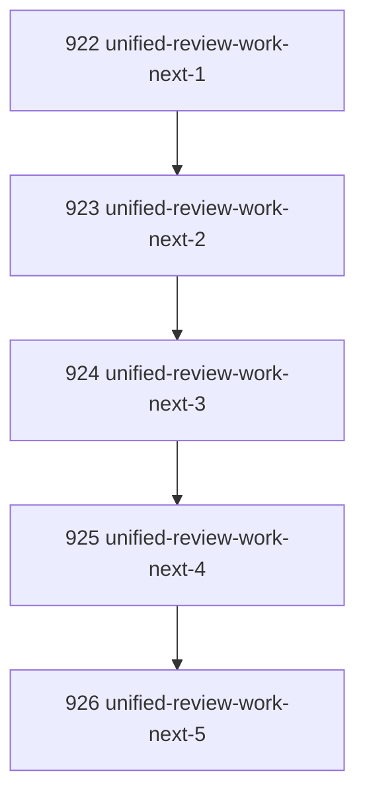

# Unified Work Next Review Routing

## Goal

Make review admission visible through the unified `work-next` surface so an agent can receive task execution, review work, inbox handling, or idle state from one command.

## DAG

## Active Tasks

| # | Task | Name | Purpose |
|---|------|------|---------|
| 1 | 922 | Define review action kind | Add `review_work` to the unified next-action grammar. |
| 2 | 923 | Discover in-review tasks | Find reviewable tasks without mutating lifecycle state. |
| 3 | 924 | Preserve task/inbox ordering | Keep task execution first and review before inbox fallback. |
| 4 | 925 | Return actionable review command | Include bounded review command args in the result. |
| 5 | 926 | Verify review routing | Add regression coverage for review-before-inbox behavior. |

## CCC Posture

| Coordinate | Evidenced State | Projected State If Chapter Verifies | Pressure Path | Evidence Required |
|------------|-----------------|-------------------------------------|---------------|-------------------|
| semantic_resolution | `work-next` lacked review as a named result | `review_work` is a first-class action kind | JSON contract and human output | Focused tests |
| invariant_preservation | Review could be skipped in favor of inbox fallback | Review discovery is read-only and delegates actual verdict to `task review` | No auto-review mutation | Test fixture |
| constructive_executability | Agents still needed to know review queue mechanics | Returned command args show the governed next command | `command_args` in primary payload | Focused tests |
| grounded_universalization | Unified work surface covered only execution/inbox | Unified surface now spans execution, review, inbox, idle | Ordered composition | Typecheck |
| authority_reviewability | Review admission was not surfaced as work | Review work is visible without crossing review boundary | `review_work` packet only | Full verify |
| teleological_pressure | Agent loop still paused on tasks awaiting review | Agent can receive review action directly | `narada work-next --agent <id>` | CLI tests |

## Deferred Work

| Deferred Capability | Rationale |
|---------------------|-----------|
| **Reviewer policy sophistication** | This chapter uses a minimal rule: in-review tasks not already reviewed by the agent and not reported by the same agent when report data exists. Deeper review capacity/rotation policy can be a later chapter. |

## Closure Criteria

- [x] All tasks in this chapter are closed or confirmed.
- [x] Semantic drift check passes.
- [x] Gap table produced.
- [x] CCC posture recorded.

## Execution Notes

1. Extended `workNextCommand` with `review_work`.
2. Added read-only review discovery over in-review tasks.
3. Preserved ordering: task execution, then review, then inbox, then idle.
4. Returned bounded review command args instead of performing review.
5. Added focused regression coverage for review-before-inbox routing.

## Verification

| Check | Result |
|-------|--------|
| `pnpm --filter @narada2/cli typecheck` | Passed |
| `pnpm --filter @narada2/cli exec vitest run test/commands/work-next.test.ts --pool=forks` | Passed, 5/5 |
