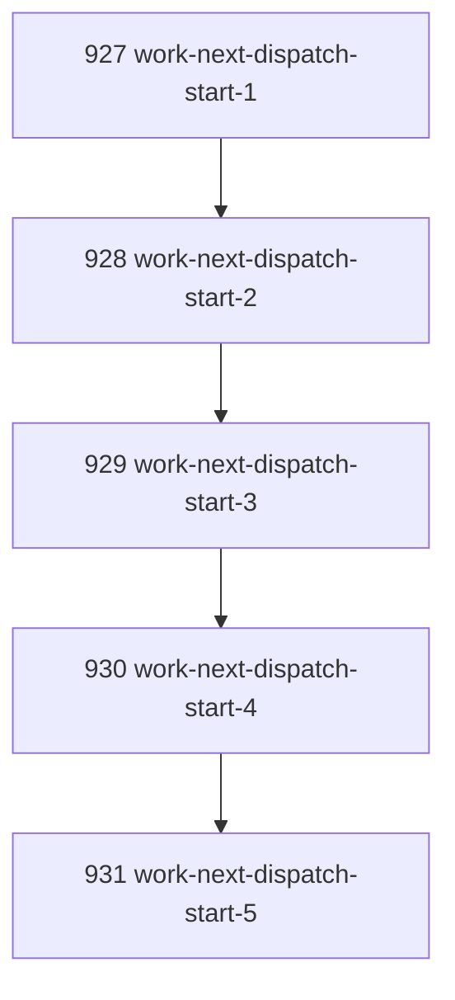

# Work Next Dispatch Start Bridge

## Goal

Let the unified `work-next` surface optionally advance selected task work into the existing dispatch pickup/start path, while keeping default behavior non-mutating beyond existing task claiming.

## DAG

## Active Tasks

| # | Task | Name | Purpose |
|---|------|------|---------|
| 1 | 927 | Define dispatch-start option | Add explicit opt-in flags without changing default `work-next`. |
| 2 | 928 | Compose dispatch pickup | Create dispatch packet only for selected task work. |
| 3 | 929 | Compose dispatch start | Return executing context and recommended command. |
| 4 | 930 | Register CLI ergonomics | Expose `--start-task` and `--exec-task`. |
| 5 | 931 | Verify bridge behavior | Test task-work dispatch start integration. |

## CCC Posture

| Coordinate | Evidenced State | Projected State If Chapter Verifies | Pressure Path | Evidence Required |
|------------|-----------------|-------------------------------------|---------------|-------------------|
| semantic_resolution | `work-next` could identify task work but not start dispatch | `--start-task` names the extra crossing | Option names and JSON payload | Focused tests |
| invariant_preservation | Risk of bypassing dispatch packet law | Command delegates to `task dispatch pickup` and `task dispatch start` | Nested dispatch result | Dispatch-backed test |
| constructive_executability | Agent still needed a second command after `task_work` | One command can return execution context | `dispatch_result.start.recommended_command` | CLI build |
| grounded_universalization | Unified surface lacked optional action enactment | Optional bridge composes existing zone crossing | No new dispatch semantics | Typecheck |
| authority_reviewability | Start decision could be implicit | `--start-task` makes mutation explicit | Default remains unchanged | Regression tests |
| teleological_pressure | Agent loop paused between work selection and dispatch | `work-next --start-task` reaches ready execution context | Kimi command returned | Full verify |

## Deferred Work

| Deferred Capability | Rationale |
|---------------------|-----------|
| **Actually spawning Kimi** | `--exec-task` currently passes through dispatch start action semantics. Real process spawning remains governed by the existing dispatch implementation and should not be expanded here. |

## Closure Criteria

- [x] All tasks in this chapter are closed or confirmed.
- [x] Semantic drift check passes.
- [x] Gap table produced.
- [x] CCC posture recorded.

## Execution Notes

1. Added `startTask` and `execTask` options to `workNextCommand`.
2. When selected action is `task_work` and `startTask` is true, the command delegates to `taskDispatchCommand` pickup and start.
3. Returned nested `dispatch_result` with pickup and start results.
4. Added root CLI options `--start-task` and `--exec-task`.
5. Added focused regression coverage for dispatch start through `work-next`.

## Verification

| Check | Result |
|-------|--------|
| `pnpm --filter @narada2/cli typecheck` | Passed |
| `pnpm --filter @narada2/cli exec vitest run test/commands/work-next.test.ts --pool=forks` | Passed, 6/6 |
