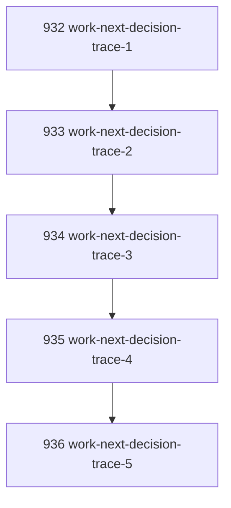

# Work Next Decision Trace

## Goal

Make unified `work-next` decisions inspectable by returning a bounded trace of every checked work zone and why the selected action won.

## DAG

## Active Tasks

| # | Task | Name | Purpose |
|---|------|------|---------|
| 1 | 932 | Define checked-zone trace | Add stable trace shape for selected and empty zones. |
| 2 | 933 | Trace task-work selection | Explain task selection or task emptiness. |
| 3 | 934 | Trace review-work selection | Explain review selection or absence. |
| 4 | 935 | Trace inbox-work selection | Explain inbox selection or idle. |
| 5 | 936 | Verify trace contract | Add regression assertions for each path. |

## CCC Posture

| Coordinate | Evidenced State | Projected State If Chapter Verifies | Pressure Path | Evidence Required |
|------------|-----------------|-------------------------------------|---------------|-------------------|
| semantic_resolution | `work-next` returned an answer without showing skipped zones | `checked[]` records selected/empty zones | Stable JSON shape | Focused tests |
| invariant_preservation | Debugging could require rerunning lower-level commands | Trace observes zone decisions without extra mutations | Trace only, no new authority | Typecheck |
| constructive_executability | Agents could not tell why inbox/idle was chosen | Result explains higher-priority absence | `reason` and `selected_ref` | Tests |
| grounded_universalization | Current surface mixed selection and explanation implicitly | Explanation becomes explicit evidence trace | `zone`, `status`, `reason` | Test coverage |
| authority_reviewability | Operator could not audit selection ordering from one output | Output shows ordered checked zones | Human and JSON output | CLI test |
| teleological_pressure | "Why did it choose this?" still caused pauses | One command carries decision rationale | Bounded trace | Full verify |

## Deferred Work

| Deferred Capability | Rationale |
|---------------------|-----------|
| **Deep recommender diagnostics** | This chapter only explains zone-level selection. Task recommender scoring diagnostics remain owned by `task recommend`. |

## Closure Criteria

- [x] All tasks in this chapter are closed or confirmed.
- [x] Semantic drift check passes.
- [x] Gap table produced.
- [x] CCC posture recorded.

## Execution Notes

1. Added `checked[]` decision trace to `workNextCommand`.
2. Added selected refs for task, review, and inbox selections.
3. Added empty reasons for task, review, and inbox zones.
4. Added human output rendering for checked zones.
5. Extended focused tests to assert trace content on task, review, inbox, and idle paths.

## Verification

| Check | Result |
|-------|--------|
| `pnpm --filter @narada2/cli typecheck` | Passed |
| `pnpm --filter @narada2/cli exec vitest run test/commands/work-next.test.ts --pool=forks` | Passed, 6/6 |
