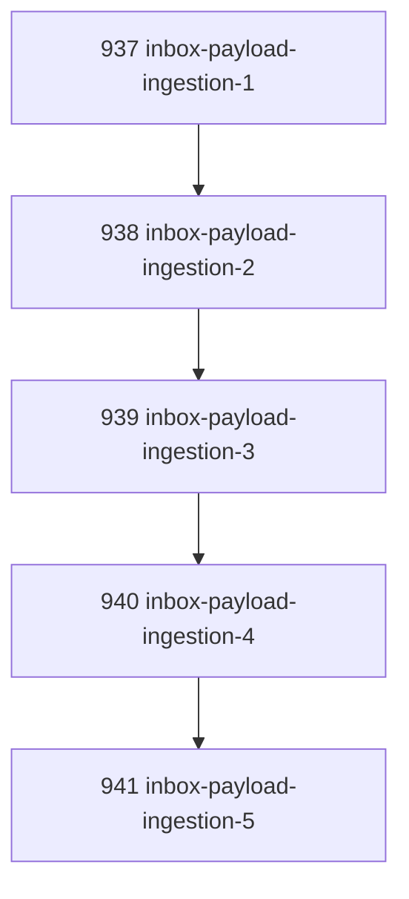

# Inbox Payload Ingestion Ergonomics

## Goal

Make Canonical Inbox submission safe across shells by supporting JSON payloads from files and stdin instead of requiring fragile inline quoting.

## DAG

## Active Tasks

| # | Task | Name | Purpose |
|---|------|------|---------|
| 1 | 937 | Add payload source contract | Define mutually exclusive inline/file/stdin payload sources. |
| 2 | 938 | Implement payload file ingestion | Read JSON payload from an operator-supplied file. |
| 3 | 939 | Implement payload stdin ingestion | Read JSON payload from stdin for pipe-safe submission. |
| 4 | 940 | Register CLI flags | Expose `--payload-file` and `--payload-stdin`. |
| 5 | 941 | Verify ingestion ergonomics | Add focused tests for file/stdin/ambiguity behavior. |

## CCC Posture

| Coordinate | Evidenced State | Projected State If Chapter Verifies | Pressure Path | Evidence Required |
|------------|-----------------|-------------------------------------|---------------|-------------------|
| semantic_resolution | Inbox submit assumed inline shell JSON | Payload source is an explicit input mode | `--payload`, `--payload-file`, `--payload-stdin` | Tests |
| invariant_preservation | Shell quoting could corrupt the envelope payload | JSON is read before existing parse/admission | Same `inboxSubmitCommand` path | Focused tests |
| constructive_executability | PowerShell JSON quoting was fragile | File/stdin paths are shell-safe | CLI flags | Typecheck |
| grounded_universalization | Windows friction exposed a general CLI ingestion issue | All shells can use file/stdin | Source exclusivity | Regression test |
| authority_reviewability | Ambiguous payload precedence would be hidden | Multiple payload sources are rejected | Error message | Test |
| teleological_pressure | Inbox proposal submission required manual quoting workarounds | Operator can submit generated JSON directly | `--payload-file`/stdin | CLI test |

## Deferred Work

| Deferred Capability | Rationale |
|---------------------|-----------|
| **Schema validation for payload kinds** | This chapter preserves untyped envelope payloads. Kind-specific schema validation can be added later without changing the ingestion source contract. |

## Closure Criteria

- [x] All tasks in this chapter are closed or confirmed.
- [x] Semantic drift check passes.
- [x] Gap table produced.
- [x] CCC posture recorded.

## Execution Notes

1. Added `payloadFile`, `payloadStdin`, and injectable `stdin` options to inbox submit.
2. Added payload source resolution before JSON parsing.
3. Rejected ambiguous payload source combinations.
4. Registered `--payload-file` and `--payload-stdin` on `narada inbox submit`.
5. Added focused tests for file payload, stdin payload, and ambiguous source rejection.

## Verification

| Check | Result |
|-------|--------|
| `pnpm --filter @narada2/cli typecheck` | Passed |
| `pnpm --filter @narada2/cli exec vitest run test/commands/inbox.test.ts --pool=forks` | Passed, 15/15 |
