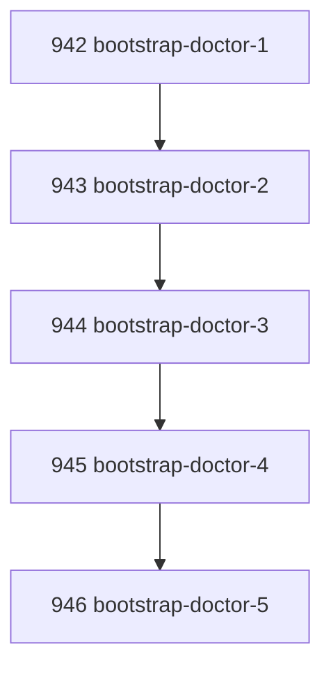

# Bootstrap Doctor Ergonomic Readiness

## Goal

Turn fresh-checkout/bootstrap friction into a first-class bounded doctor surface that reports repository readiness and exact remediation before operators hit install/build/native-binding failures later.

## DAG

## Active Tasks

| # | Task | Name | Purpose |
|---|------|------|---------|
| 1 | 942 | Define bootstrap doctor mode | Add config-independent readiness diagnosis. |
| 2 | 943 | Check install/build posture | Detect manifest, lockfile, dependencies, CLI build, and bin link. |
| 3 | 944 | Check native SQLite readiness | Detect `better-sqlite3` native binding load from repo root. |
| 4 | 945 | Register ergonomic CLI flag | Expose `narada doctor --bootstrap`. |
| 5 | 946 | Verify bootstrap diagnostics | Add focused tests and live repo check. |

## CCC Posture

| Coordinate | Evidenced State | Projected State If Chapter Verifies | Pressure Path | Evidence Required |
|------------|-----------------|-------------------------------------|---------------|-------------------|
| semantic_resolution | Fresh checkout failures appeared as scattered runtime errors | Bootstrap readiness is a named doctor mode | `doctor --bootstrap` | Focused tests |
| invariant_preservation | Operators could repair by copying native bindings manually | Native binding readiness is diagnosed with remediation | `better-sqlite3-native` check | Live check |
| constructive_executability | Build/install order was implicit | Doctor reports exact commands to run | Remediation fields | Tests |
| grounded_universalization | Windows trial exposed general repo readiness issues | Checks are substrate-neutral repo checks | Node/install/build/bin/native | Live repo output |
| authority_reviewability | Bootstrap posture lacked bounded evidence | JSON report has pass/fail/warn summary | Bounded doctor result | `pnpm verify` |
| teleological_pressure | Operators hit failures too late | Failure moves to preflight | One command before work | CLI flag |

## Deferred Work

| Deferred Capability | Rationale |
|---------------------|-----------|
| **Automatic repair** | This chapter diagnoses only. A later `--fix` or separate bootstrap repair crossing can run install/build/rebuild under explicit operator authority. |

## Closure Criteria

- [x] All tasks in this chapter are closed or confirmed.
- [x] Semantic drift check passes.
- [x] Gap table produced.
- [x] CCC posture recorded.

## Execution Notes

1. Added `doctor --bootstrap` mode that bypasses operation config loading.
2. Added checks for Node version, package manifest, pnpm lockfile, installed dependencies, CLI build output, Narada bin link, and `better-sqlite3` native binding readiness.
3. Resolved `better-sqlite3` from the repository root package context so CLI dist can diagnose the actual checkout.
4. Registered `--bootstrap` and `--cwd` on `narada doctor`.
5. Added focused doctor tests for bootstrap readiness and degraded remediation.

## Verification

| Check | Result |
|-------|--------|
| `pnpm --filter @narada2/cli typecheck` | Passed |
| `pnpm --filter @narada2/cli exec vitest run test/commands/doctor.test.ts --pool=forks` | Passed, 8/8 |
| `pnpm --filter @narada2/cli build` | Passed |
| `pnpm narada doctor --bootstrap --format json` | Passed, healthy |
