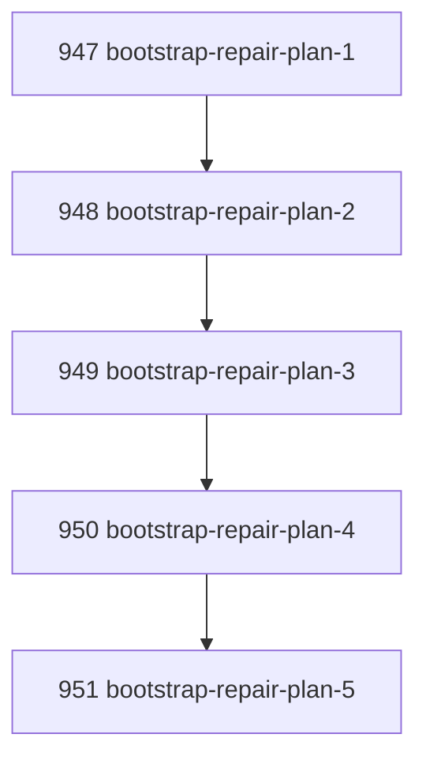

# Bootstrap Doctor Repair Plan

## Goal

Make bootstrap doctor output not merely diagnostic but operationally actionable by returning an ordered, structured repair plan with command strings and argv arrays for failed/warn readiness checks.

## DAG

## Active Tasks

| # | Task | Name | Purpose |
|---|------|------|---------|
| 1 | 947 | Add remediation command contract | Extend doctor checks with structured command metadata. |
| 2 | 948 | Populate install/build repair steps | Add commands for dependencies, build, and shell bin repair. |
| 3 | 949 | Populate native binding repair step | Add command for `better-sqlite3` rebuild. |
| 4 | 950 | Emit ordered repair plan | Return a bounded `repair_plan` from bootstrap doctor. |
| 5 | 951 | Verify repair plan contract | Add assertions for command args and live healthy output. |

## CCC Posture

| Coordinate | Evidenced State | Projected State If Chapter Verifies | Pressure Path | Evidence Required |
|------------|-----------------|-------------------------------------|---------------|-------------------|
| semantic_resolution | Remediation was human prose only | Remediation commands are structured | `remediation_command`, `remediation_args` | Focused tests |
| invariant_preservation | Repair remained informal | Doctor still diagnoses only, but emits governed command plan | No auto-execution | JSON output |
| constructive_executability | Operator had to translate text to shell | Repair plan is directly copyable/invokable | `repair_plan[]` | Tests |
| grounded_universalization | Fresh checkout repair differed by failure | Same check model emits repair steps | Per-check command metadata | Live check |
| authority_reviewability | UI/agents could not safely consume prose remediation | Args are machine-readable | `args` array | Test assertions |
| teleological_pressure | Diagnostic stop still required interpretation | Next commands are explicit | Ordered plan | Full verify |

## Deferred Work

| Deferred Capability | Rationale |
|---------------------|-----------|
| **Automatic `--fix` execution** | This chapter deliberately stops at structured repair plan. Executing install/build/rebuild should be a separate explicit mutation crossing. |

## Closure Criteria

- [x] All tasks in this chapter are closed or confirmed.
- [x] Semantic drift check passes.
- [x] Gap table produced.
- [x] CCC posture recorded.

## Execution Notes

1. Extended doctor checks with `remediation_command` and `remediation_args`.
2. Added structured commands for `pnpm install`, `pnpm -r build`, `pnpm run narada:install-shim`, and `pnpm rebuild better-sqlite3`.
3. Added bootstrap doctor `repair_plan` that includes only non-passing checks with structured remediation.
4. Added human rendering for repair plan commands.
5. Extended focused tests to assert repair plan content and argv.

## Verification

| Check | Result |
|-------|--------|
| `pnpm --filter @narada2/cli typecheck` | Passed |
| `pnpm --filter @narada2/cli exec vitest run test/commands/doctor.test.ts --pool=forks` | Passed, 8/8 |
| `pnpm --filter @narada2/cli build` | Passed |
| `pnpm narada doctor --bootstrap --format json` | Passed, healthy with empty repair plan |
