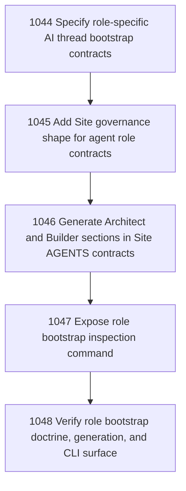

# Role-Specific AI Thread Bootstrap

## Goal

Create a role-specific AI thread bootstrap model for currently inhabited Narada self-build roles: Operator, Architect, and Builder. The chapter turns the newly inhabited architect/builder split into durable Site bootstrap doctrine and tooling without admitting speculative roles by symmetry.

## DAG

## Active Tasks

| # | Task | Name | Purpose |
|---|------|------|---------|
| 1 | 1044 | Specify role-specific AI thread bootstrap contracts | Define the admitted Architect and Builder thread bootstrap contracts without adding speculative roles or collapsing Operator authority. |
| 2 | 1045 | Add Site governance shape for agent role contracts | Extend Site governance coordinates to describe role-specific agent bootstrap contracts without changing runtime authority by implication. |
| 3 | 1046 | Generate Architect and Builder sections in Site AGENTS contracts | Update Site bootstrap generation so new Sites include role-specific Architect and Builder thread instructions in generated AGENTS.md. |
| 4 | 1047 | Expose role bootstrap inspection command | Add a bounded CLI read surface that shows the correct AI thread bootstrap contract for a Site role. |
| 5 | 1048 | Verify role bootstrap doctrine, generation, and CLI surface | Add focused tests and evidence for the role-specific AI thread bootstrap chapter. |

## CCC Posture

| Coordinate | Evidenced State | Projected State If Chapter Verifies | Pressure Path | Evidence Required |
|------------|-----------------|-------------------------------------|---------------|-------------------|
| semantic_resolution | 0 | +1 | 1044, 1045 | Role contracts and Site governance coordinates distinguish architect and builder without vague agent identity. |
| invariant_preservation | 0 | +1 | 1044, 1046 | Generated bootstrap preserves Operator authority, Site authority locus, and Intelligence-Authority Separation. |
| constructive_executability | 0 | +1 | 1046, 1047, 1048 | New Sites emit usable role sections and a read-only command can show the selected role bootstrap. |
| grounded_universalization | 0 | +1 | 1044 | The chapter admits only roles already inhabited in this operation and defers all speculative role expansion. |
| authority_reviewability | 0 | +1 | 1047, 1048 | Bootstrap output is bounded and inspectable; tests prove role selection and unknown-role rejection. |
| teleological_pressure | 0 | +1 | 1044-1048 | Fresh threads can enter the operation with the right responsibilities instead of re-learning standing law through chat. |

## Deferred Work

| Deferred Capability | Rationale |
|---------------------|-----------|
| **Inspector / clerk / PM / superintendent roles** | Discussed but not yet admitted by inhabited operation evidence. They remain possibility/proposal/residual only. |
| **Runtime role permission enforcement** | This chapter orients threads and generated Site contracts; it does not create a new authorization subsystem. |
| **Automatic agent launching** | Fresh-thread bootstrap remains an Operator-mediated/read-only surface, not an autonomous role manager. |

## Closure Criteria

- [ ] All tasks in this chapter are closed or confirmed.
- [ ] Semantic drift check passes.
- [ ] Gap table produced.
- [ ] CCC posture recorded.
