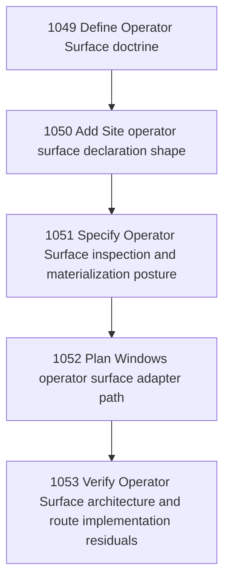

# Operator Surface Architecture

## Goal

Architect the Operator Surface concept and build path: a durable, addressable interface through which an Operator or agent inhabits a Site, role, workflow, or operational locus. The chapter keeps Windows Terminal, Komorebi, YASB, VS Code, browser, MCP, and daemon panels as adapters, not the primitive and not authority.

## DAG

## Active Tasks

| # | Task | Name | Purpose |
|---|------|------|---------|
| 1 | 1049 | Define Operator Surface doctrine | Define Operator Surface as a first-class Narada concept while preserving Site authority, embodiment, and Intelligence-Authority Separation. |
| 2 | 1050 | Add Site operator surface declaration shape | Extend Site governance/product documentation with declarative operator_surfaces that remain orientation and recovery metadata, not authority. |
| 3 | 1051 | Specify Operator Surface inspection and materialization posture | Define the CLI posture for inspecting and later materializing Operator Surfaces without creating hidden authority or autonomous UI mutation. |
| 4 | 1052 | Plan Windows operator surface adapter path | Produce a bounded implementation plan for Windows Terminal, Komorebi, and YASB Operator Surface adapters without building them yet. |
| 5 | 1053 | Verify Operator Surface architecture and route implementation residuals | Verify the Operator Surface chapter artifacts and route any build work to Builder-owned tasks or external Site inboxes. |

## CCC Posture

| Coordinate | Evidenced State | Projected State If Chapter Verifies | Pressure Path | Evidence Required |
|------------|-----------------|-------------------------------------|---------------|-------------------|
| semantic_resolution | 0 | +1 | 1049, 1050 | Operator Surface is defined separately from adapters, Sites, roles, and authority. |
| invariant_preservation | 0 | +1 | 1049, 1051 | Surface inspection/materialization keeps authority crossings explicit and avoids autonomous UI mutation. |
| constructive_executability | 0 | +1 | 1050, 1051, 1052 | Sites can declare surfaces and Builder can later implement read/materialization paths from a bounded spec. |
| grounded_universalization | 0 | +1 | 1049, 1052 | The concept is earned from Windows User Site friction but generalized only through invariant fields and adapter boundaries. |
| authority_reviewability | 0 | +1 | 1051, 1053 | Materialization posture and verification/residual routing make Inspector review possible. |
| teleological_pressure | +1 | +1 | 1049-1053 | Inhabited work gains stable, recoverable surfaces without confusing UI convenience with authority. |

## Deferred Work

| Deferred Capability | Rationale |
|---------------------|-----------|
| **Adapter materializers** | Windows Terminal, Komorebi, YASB, VS Code, browser, MCP, and daemon-panel materializers require Builder implementation tasks and appropriate Site authority. |
| **Runtime permission enforcement** | Operator Surface is orientation/recovery/interface metadata first; capability and effect authority stay in existing governed surfaces. |
| **Autonomous surface manager** | No infinite or self-grooming UI manager is admitted by this chapter. |

## Closure Criteria

- [ ] All tasks in this chapter are closed or confirmed.
- [ ] Semantic drift check passes.
- [ ] Gap table produced.
- [ ] CCC posture recorded.
