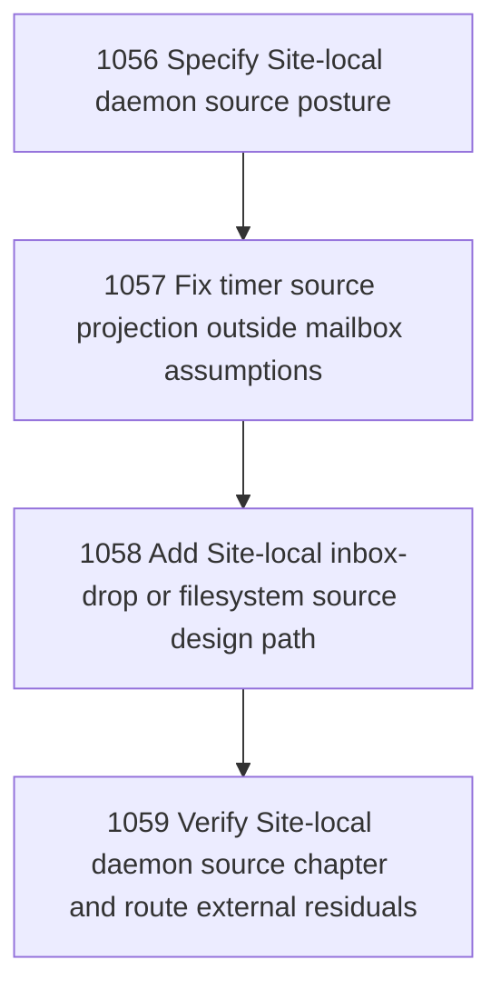

# Site-Local Daemon Source Path

## Goal

Create a coherent Site-local daemon source path for non-mailbox Project/Site loci: timer heartbeat, inbox-drop, and bounded filesystem observations must not be projected through mailbox-shaped assumptions.

## DAG

## Active Tasks

| # | Task | Name | Purpose |
|---|------|------|---------|
| 1 | 1056 | Specify Site-local daemon source posture | Define the coherent source/admission posture for Project and Site-local daemons that are not mailbox verticals. |
| 2 | 1057 | Fix timer source projection outside mailbox assumptions | Make configured timer sources admissible in the daemon/control-plane path without passing through mailbox-only event projection. |
| 3 | 1058 | Add Site-local inbox-drop or filesystem source design path | Define and, if small enough, implement the first coherent Site-local inbox-drop/filesystem source for project-locus daemons. |
| 4 | 1059 | Verify Site-local daemon source chapter and route external residuals | Verify the daemon source chapter, publish source-envelope evidence, and route any thoughts/User/PC Site implementation residuals to the correct authority locus. |

## CCC Posture

| Coordinate | Evidenced State | Projected State If Chapter Verifies | Pressure Path | Evidence Required |
|------------|-----------------|-------------------------------------|---------------|-------------------|
| semantic_resolution | 0 | +1 | 1056, 1057 | Site-local daemon sources are distinguished from mailbox vertical projection. |
| invariant_preservation | 0 | +1 | 1056-1058 | Source observations remain inert until admitted/promoted through governed surfaces. |
| constructive_executability | 0 | +1 | 1057, 1058 | Timer and inbox-drop/filesystem paths become implementable/testable without mock fallback. |
| grounded_universalization | 0 | +1 | 1056, 1059 | The thoughts Project Site failure is generalized only to the non-mailbox Site-local source invariant. |
| authority_reviewability | 0 | +1 | 1059 | External Site residuals are routed instead of mutated from Narada proper. |
| teleological_pressure | +1 | +1 | 1056-1059 | Sites can gain useful daemon presence without pretending every daemon is mailbox-shaped. |

## Deferred Work

| Deferred Capability | Rationale |
|---------------------|-----------|
| **Thoughts Site local config repair** | The originating Site owns its `.narada` daemon config/runtime; Narada proper should route residuals rather than mutate it by convenience. |
| **Long-running watcher service** | This chapter can define/fix bounded source behavior; unattended watch/supervisor behavior remains separate. |
| **Arbitrary filesystem watching** | Any filesystem source must be bounded and explicit; broad watch trees are deferred. |

## Closure Criteria

- [ ] All tasks in this chapter are closed or confirmed.
- [ ] Semantic drift check passes.
- [ ] Gap table produced.
- [ ] CCC posture recorded.
