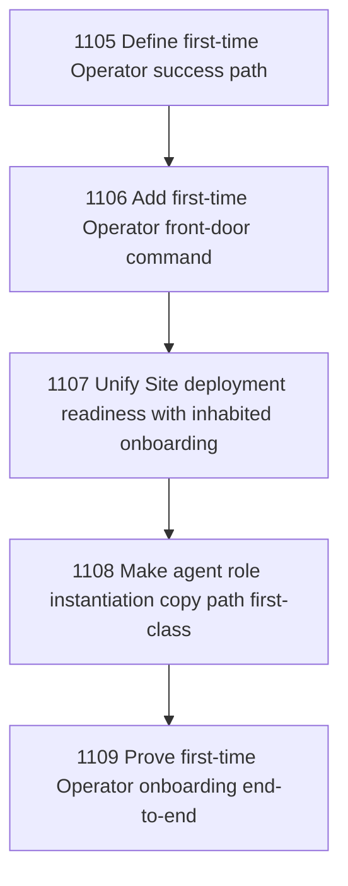

# First-Time Operator Ergonomics

## Goal

Commissioned chapter first-time-operator-ergonomics for tasks 1105-1109.

## DAG

## Active Tasks

| # | Task | Name | Status |
|---|------|------|--------|
| 1 | 1105 | Define first-time Operator success path | opened |
| 2 | 1106 | Add first-time Operator front-door command | opened |
| 3 | 1107 | Unify Site deployment readiness with inhabited onboarding | opened |
| 4 | 1108 | Make agent role instantiation copy path first-class | opened |
| 5 | 1109 | Prove first-time Operator onboarding end-to-end | opened |

## Closure Criteria

- [ ] All commissioned tasks are closed or confirmed.
- [ ] Chapter evidence is complete.
