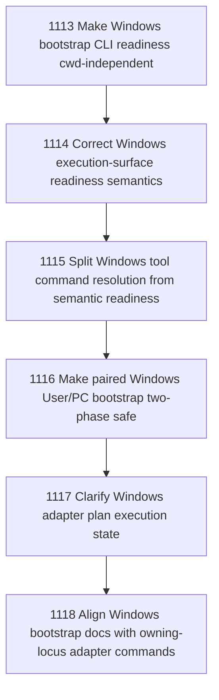

# Windows Bootstrap Correctness

## Goal

Commissioned chapter windows-bootstrap-correctness for tasks 1113-1118.

## DAG

## Active Tasks

| # | Task | Name | Status |
|---|------|------|--------|
| 1 | 1113 | Make Windows bootstrap CLI readiness cwd-independent | opened |
| 2 | 1114 | Correct Windows execution-surface readiness semantics | opened |
| 3 | 1115 | Split Windows tool command resolution from semantic readiness | opened |
| 4 | 1116 | Make paired Windows User/PC bootstrap two-phase safe | opened |
| 5 | 1117 | Clarify Windows adapter plan execution state | opened |
| 6 | 1118 | Align Windows bootstrap docs with owning-locus adapter commands | opened |

## Closure Criteria

- [ ] All commissioned tasks are closed or confirmed.
- [ ] Chapter evidence is complete.
