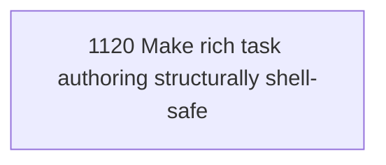

# Safe Task Authoring Input

## Goal

Commissioned chapter safe-task-authoring-input for tasks 1120-1120.

## DAG

## Active Tasks

| # | Task | Name | Status |
|---|------|------|--------|
| 1 | 1120 | Make rich task authoring structurally shell-safe | opened |

## Closure Criteria

- [ ] All commissioned tasks are closed or confirmed.
- [ ] Chapter evidence is complete.
