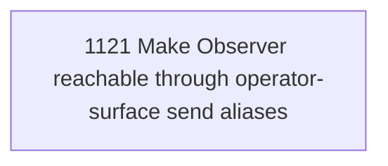

# Observer Surface Addressability

## Goal

Commissioned chapter observer-surface-addressability for tasks 1121-1121.

## DAG

## Active Tasks

| # | Task | Name | Status |
|---|------|------|--------|
| 1 | 1121 | Make Observer reachable through operator-surface send aliases | opened |

## Closure Criteria

- [ ] All commissioned tasks are closed or confirmed.
- [ ] Chapter evidence is complete.
