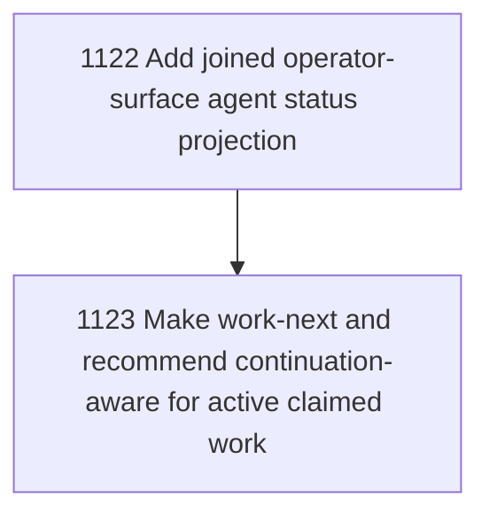

# Operator Surface Work-State Ergonomics

## Goal

Commissioned chapter operator-surface-workstate-ergonomics for tasks 1122-1123.

## DAG

## Active Tasks

| # | Task | Name | Status |
|---|------|------|--------|
| 1 | 1122 | Add joined operator-surface agent status projection | opened |
| 2 | 1123 | Make work-next and recommend continuation-aware for active claimed work | opened |

## Closure Criteria

- [ ] All commissioned tasks are closed or confirmed.
- [ ] Chapter evidence is complete.
