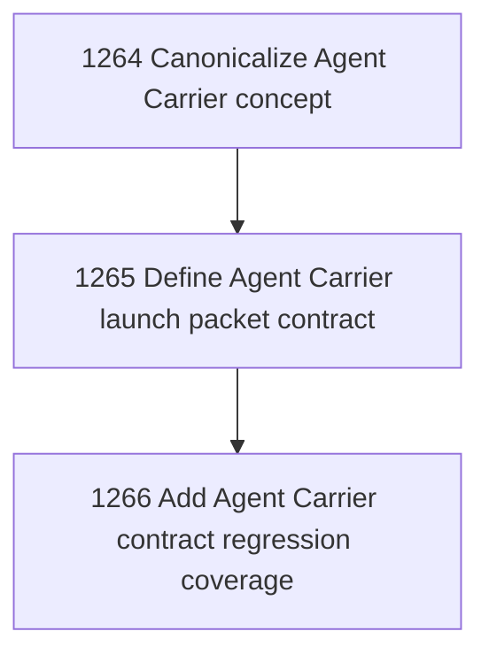

# Agent Carrier Factorization

## Goal

Commissioned chapter agent-carrier-factorization for tasks 1264-1266.

## DAG

## Active Tasks

| # | Task | Name | Status |
|---|------|------|--------|
| 1 | 1264 | Canonicalize Agent Carrier concept | confirmed |
| 2 | 1265 | Define Agent Carrier launch packet contract | confirmed |
| 3 | 1266 | Add Agent Carrier contract regression coverage | confirmed |

## Closure Criteria

- [x] All commissioned tasks are closed or confirmed.
- [x] Chapter evidence is complete.

## Closure Evidence

- Task 1264 confirmed Agent Carrier doctrine and Operator Surface integration.
- Task 1265 confirmed the product-level launch packet contract artifact.
- Task 1266 confirmed focused regression coverage for carrier factorization and launch packet invariants.
- Chapter range 1264-1266 was closed through `narada chapter close 1264-1266 --finish --by narada.architect`.
