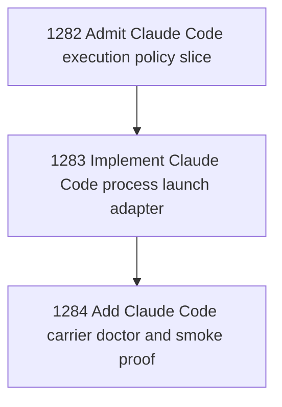

# Claude Code Agent Carrier Stage 2

## Goal

Commissioned chapter claude-code-carrier-stage-2 for tasks 1282-1284.

## DAG

## Active Tasks

| # | Task | Name | Status |
|---|------|------|--------|
| 1 | 1282 | Admit Claude Code execution policy slice | opened |
| 2 | 1283 | Implement Claude Code process launch adapter | opened |
| 3 | 1284 | Add Claude Code carrier doctor and smoke proof | opened |

## Closure Criteria

- [ ] All commissioned tasks are closed or confirmed.
- [ ] Chapter evidence is complete.
