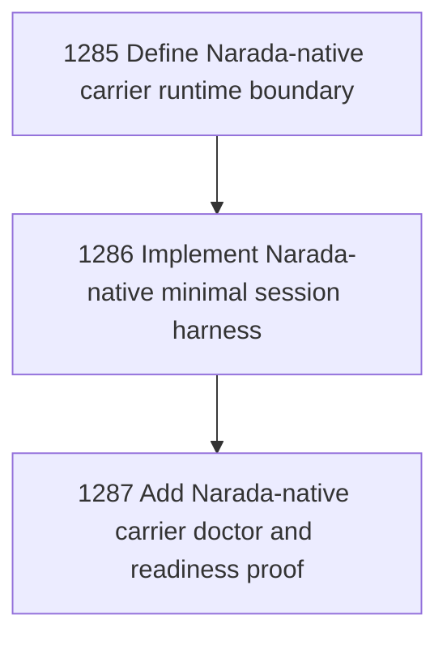

# Narada-Native Agent Carrier Stage 2

## Goal

Commissioned chapter narada-native-carrier-stage-2 for tasks 1285-1287.

## DAG

## Active Tasks

| # | Task | Name | Status |
|---|------|------|--------|
| 1 | 1285 | Define Narada-native carrier runtime boundary | opened |
| 2 | 1286 | Implement Narada-native minimal session harness | opened |
| 3 | 1287 | Add Narada-native carrier doctor and readiness proof | opened |

## Closure Criteria

- [ ] All commissioned tasks are closed or confirmed.
- [ ] Chapter evidence is complete.
