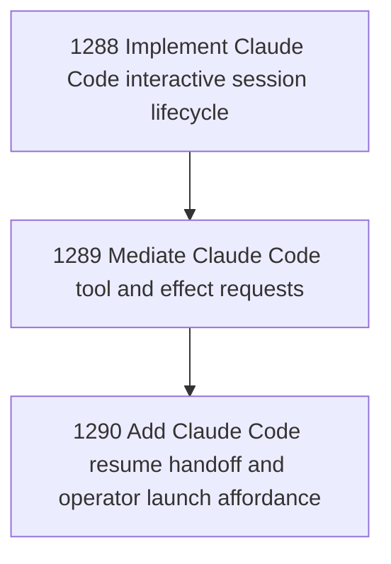

# Claude Code Agent Carrier Stage 3

## Goal

Commissioned chapter claude-code-carrier-stage-3 for tasks 1288-1290.

## DAG

## Active Tasks

| # | Task | Name | Status |
|---|------|------|--------|
| 1 | 1288 | Implement Claude Code interactive session lifecycle | opened |
| 2 | 1289 | Mediate Claude Code tool and effect requests | opened |
| 3 | 1290 | Add Claude Code resume handoff and operator launch affordance | opened |

## Closure Criteria

- [ ] All commissioned tasks are closed or confirmed.
- [ ] Chapter evidence is complete.
